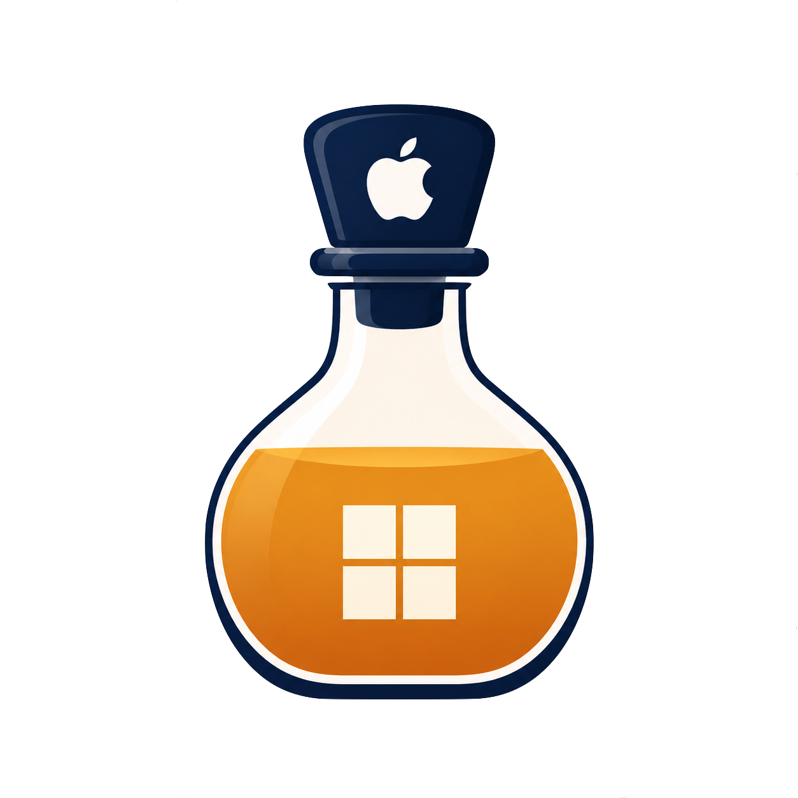

<p align="center">
  
</p>

# CyderBits

**Run legacy Windows games on Mac — DirectDraw & GDI first.**

Built for 2D and classic Win32 graphics (DirectDraw, GDI). **DXVK, Vulkan, and modern 3D pipelines are not supported yet.**

CyderBits builds CrossOver-based Wine on Apple Silicon and ships **Cyder** — a tool that wraps `.exe` files as double-clickable macOS `.app` bundles.

**Languages:** [English](README.md) · [繁體中文](README.zh-TW.md)

## Cyder (the app)

| | |
|---|---|
| **What** | Pick a Windows `.exe` → get a macOS game `.app` |
| **Engine** | Shared Wine under `~/Library/Application Support/Cyder/Engines/` |
| **Docs** | [docs/cyder.md](docs/cyder.md) |

```bash
bash scripts/create-cyder-app.sh
open dist/Cyder.app
```

## Validation game

Development and smoke tests target **[BlueCG](https://www.bluecg.net/forum.php?mod=viewthread&tid=18)** (魔力寶貝), a DirectDraw PE32 title. Place the game files locally as `BlueCrossgateNew/` (not in git).

```bash
bash scripts/run-bluecg.sh
```

## Wine sources

Wine is built from the **CrossOver open-source release** — extract into `sources/` (see [CodeWeavers CrossOver Source](https://www.codeweavers.com/crossover/source)). The tree used at build time is `sources/wine/`.

```bash
bash scripts/build-wine.sh
bash scripts/sign-wine.sh
```

## Requirements

- macOS 12+ (13+ recommended)
- Apple Silicon + Rosetta 2 (Wine is an **x86_64** build)
- Several GB disk for Wine sources, `.brew-x86`, and build outputs (most paths are `.gitignore`d)

## Quick start

### 1. Build Wine (first time; slow)

```bash
bash scripts/build-wine.sh
bash scripts/sign-wine.sh
```

### 2. Validate with BlueCG

```bash
bash scripts/run-bluecg.sh
bash scripts/enable-mac-retina-hires.sh   # optional Retina + 200% DPI
```

### 3. Wrap any EXE with Cyder

```bash
bash scripts/create-cyder-app.sh
open dist/Cyder.app
# or: python3 scripts/cyder_create_game_app.py --gui
```

## Repository layout

```text
├── logo/                       # cyderbits.png (app icon), cyderbits-transparent.png (README)
├── config/entitlements.plist   # Wine JIT / dyld signing entitlements
├── patches/                    # Optional source patches
├── scripts/                    # Build, run, packaging
├── tests/                      # Script smoke tests
├── docs/                       # Guides (see docs/README.md)
├── sources/wine/               # CrossOver Wine sources (.gitignore)
├── .brew-x86/                  # Project-local x86_64 Homebrew (.gitignore)
├── install/wine-x86_64/        # Wine install prefix (.gitignore)
└── BlueCrossgateNew/           # BlueCG game + prefix (.gitignore)
```

## Tests

```bash
bash tests/test-env-x86_64.sh
bash tests/test-build-wine.sh
bash tests/test-sign-wine.sh
bash tests/test-run-bluecg.sh
bash tests/test-verify-bluecg.sh
```

## Documentation

- [docs/README.md](docs/README.md) — index
- [docs/cyder.md](docs/cyder.md) — Cyder usage
- [docs/bluecg.md](docs/bluecg.md) — BlueCG workflow
- [docs/scripts.md](docs/scripts.md) — script reference
- [docs/superpowers/](docs/superpowers/) — design specs

## Sources and licensing

Wine sources come from the [CrossOver open-source release](https://www.codeweavers.com/crossover/source). Game files and large binaries are not in git; obtain them separately (e.g. [BlueCG](https://www.bluecg.net/forum.php?mod=viewthread&tid=18)).
