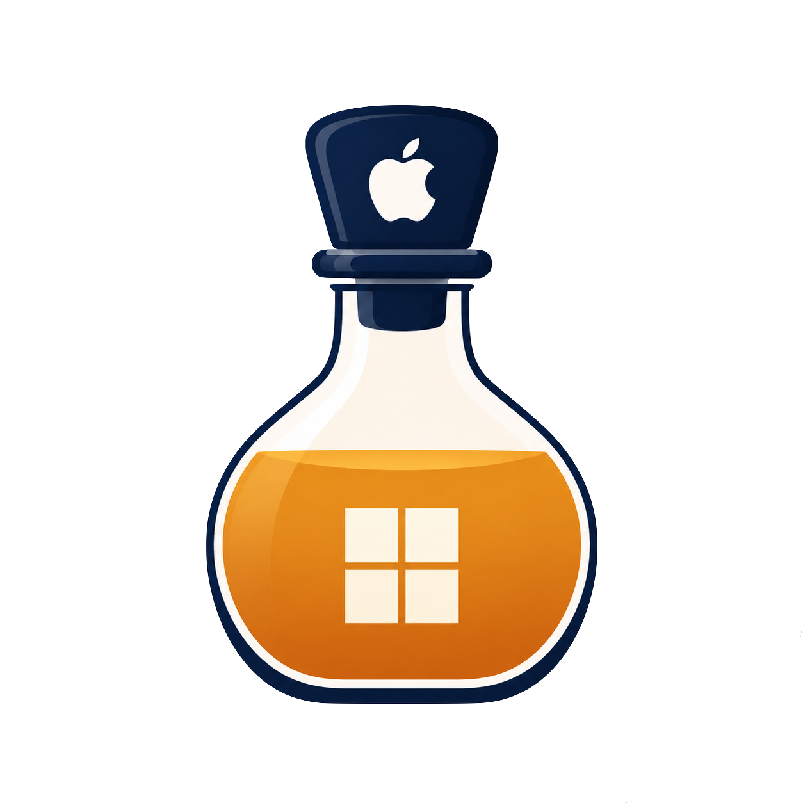

<p align="center">
  
</p>

# CyderBits

**在 Mac 上跑經典 Windows 遊戲 — Cyder 0.11.1 以 DirectDraw 與 GDI 為驗證基準，並提供可選圖形 backend。**

驗證路徑仍是傳統 2D Win32 圖形：**DirectDraw → Wine wined3d/OpenGL** 與 GDI。Cyder 0.11.1 使用 `CX26.3.0-W11-Cyder011` engine；DXVK／DXMT 以獨立 graphics payload 提供，D3DMetal 透過 GPTK 提供。實際遊戲相容性仍需依遊戲、macOS 版本與 backend 個別驗證。

本 repo（CyderBits）目前主要是**應用層**：Cyder 啟動器、遊戲庫、設定、CompatDB 與打包器。實際執行 Windows `.exe` 的 Wine 核心在獨立專案 [cyder-wine-engine](https://github.com/dspp779/cyder-wine-engine)。

本專案提供兩個工具：**Cyder** — 一鍵啟動 `.exe` — 與 **CyderBits** — 把 `.exe` 包成可雙擊的 macOS `.app`。

**語言：** [English](README.md) · [繁體中文](README.zh-TW.md)

## Cyder（啟動器）

| | |
|---|---|
| **用途** | 直接開啟 Windows `.exe`（共用 SharedPrefix） |
| **引擎** | 共用 Wine（`~/.cyder/runtime/Engines/`，刻意避免空白） |
| **文件** | [docs/cyder.md](docs/cyder.md) |

```bash
bash scripts/create-cyder-app.sh
open dist/Cyder.app
```

## CyderBits（打包器）

| | |
|---|---|
| **用途** | 選 Windows `.exe` → 產生 macOS 遊戲 `.app` |
| **Prefix** | 每遊戲 bottle（`~/Library/Application Support/Cyder/Bottles/`，Phase 1） |
| **文件** | [docs/cyderbits.md](docs/cyderbits.md) |

```bash
bash scripts/create-cyderbits-app.sh
open dist/CyderBits.app
```

## 驗證用遊戲

開發與 smoke test 以 **[BlueCG](https://www.bluecg.net/forum.php?mod=viewthread&tid=18)**（魔力寶貝，DirectDraw PE32）為基準。請自行將遊戲放到本機 `BlueCrossgateNew/`（不納入 git）。

```bash
bash scripts/run-bluecg.sh
```

## 🎮 已測試遊戲相容性

目前已測試過並確認可運行的遊戲清單如下，完整測試細節、啟動參數與 Workaround 請參閱 **[📋 遊戲相容性矩陣 (Compatibility Matrix)](docs/games/compatibility-matrix.md)**。

| 類別 | 遊戲名稱 | 測試狀態 | 關鍵設定 / 備註 |
|:---:|:---|:---:|:---|
| **單機** | 世紀帝國 2 (3.8) | ⚠️ 可玩 | 每 5 秒會頓一下 (已知 Wine/macOS 問題) |
| **單機** | 大富翁 4 | 🟡 需 ddraw | 原版黑畫面，需搭配 `cnc-ddraw` 顯示才正常 |
| **單機** | 皮卡丘打排球 | 🟡 特殊條件 | 建議關閉 MSync；CrossOver 需開啟儲存 log 檔 |
| **單機** | 洛克人 X3 / X4 | ⚠️ 提示可玩 | 啟動會跳 DirectX 初始化錯誤，按掉後可正常遊玩 |
| **單機** | 洛克人 X5 | ⚠️ 畫面縮放 | 可正常遊玩，畫面縮在左上角 |
| **單機** | 越南大戰 | 🟢 可玩 | 停用 Retina Mode 即可正常遊玩 |
| **單機** | 暗黑破壞神 2 | 🟢 可玩 | 停用 Retina Mode 即可正常遊玩 |
| **單機** | 魔獸爭霸 3 | 🟢 可玩 | 搭配啟動參數 `-nativefullscr` 開啟最高解析度 |
| **單機** | 小朋友齊打交 2 (1.9c) | 🟢 可玩 | 可直接執行遊玩 |
| **單機** | 小朋友齊打交 2 (2.0a) | 🟡 需依賴庫 | 需透過 `winetricks` 安裝 `vcrun2005`, `wmp9`, `quartz`, `devenum`, `vb6run` |
| **線上** | 水藍魔力 (BlueCG) | 🟢 可玩 | 專案驗證基準 (DirectDraw / GDI) |
| **線上** | 新楓之谷 | 🟡 部分驗證 | 需 MapleStory Launcher、[CitrusGate](https://github.com/dspp779/CitrusGate) 與有效 OTP；CX26 版本仍需完成地圖級驗收 |
| **線上** | 新楓之谷 經典版 | 🟡 部分驗證 | 需 [CitrusGate](https://github.com/dspp779/CitrusGate) 傳送 OTP；QDO workaround 與背景程序清理仍有已知限制 |
| **線上** | 爆爆王 | 🟡 歷史驗證 | 服務可用性與目前版本相容性未在 Cyder 0.10.1 重新驗證 |

## 圖形 backend 狀態

| Backend | 專案狀態 | 說明 |
|---|---|---|
| DirectDraw / GDI | **支援且已驗證** | BlueCG 使用 DirectDraw；預設路徑是 wined3d/OpenGL，GDI 是相容性 fallback。 |
| wined3d / OpenGL | **目前預設** | BlueCG 驗證用 engine 含已測試的 `winemac.drv` same-view backing 修復，可支援 Retina/DPI resize。 |
| Vulkan / MoltenVK | **由 Cyder011 engine 提供** | x86_64 Wine 內含 `libMoltenVK.dylib`（macOS 10.15 minos）；Cyder011 不使用舊的 `libMoltenVK.real.dylib` shim pair。這不是 BlueCG 的主要繪圖路徑。 |
| DXVK | **已整合 runtime payload** | DXVK 由 Cyder.app 的 `Resources/graphics/` 外部 payload 提供，透過 CompatDB builtin + prepend 載入；DXVK 2 仍暫不出貨。 |
| dxmt | **已整合 runtime payload** | DXMT 由 Cyder.app 的外部 payload 提供，需 macOS 15+；新楓之谷與經典版在 macOS 15+ 預設優先使用。 |
| D3DMetal | **已接入產品 backend** | 透過 GPTK／Apple D3DMetal，需 macOS 14+ 與可用 GPTK；實際遊戲相容性需逐款驗證。 |

詳見 [Wine configure 與圖形選項](docs/wine-configure-options.md)、
[DXVK 編譯備忘](docs/build-dxvk.zh-TW.md)。

## Wine 引擎

實際執行 `.exe` 的核心在 [cyder-wine-engine](https://github.com/dspp779/cyder-wine-engine)。Wine 來自 **CrossOver 開源釋出**（見 [CodeWeavers CrossOver Source](https://www.codeweavers.com/crossover/source)）；正式建置、patch 與打包請在該 repo 進行。本 repo 仍留有相容建置腳本副本；archive 放在 `tools/archives/`，建置時解壓至 `build/cx26/`。專案邊界見 [docs/cyder-wine-engine-project.md](docs/cyder-wine-engine-project.md)。

```bash
bash scripts/build-wine.sh --cx 26
bash scripts/sign-wine.sh
```

## 系統需求

- **Cyder.app：** macOS 10.15+（`LSMinimumSystemVersion`）；遊戲庫／設定 UI 需 **11+**（10.15 首次安裝會顯示終端機，完成後以 bash 選檔／啟動）
- **遊戲位置：** 建議放在 `~/Games`；Documents、Desktop、Downloads、雲端或外接磁碟可能只授權 EXE，卻阻擋同資料夾的 DLL
- **開發／建置：** 建議 macOS 12+（日常開發建議 13+）
- Apple Silicon + Rosetta 2（Wine 為 **x86_64** build；Apple Silicon 自 macOS 11+ 起需 Rosetta）
- 磁碟需數 GB（原始碼、`.brew-x86`、build 產物；多數在 `.gitignore`）

## 快速開始

### 1. 建 Wine（首次，耗時長；正式流程在 cyder-wine-engine）

```bash
bash scripts/build-wine.sh --cx 26 --install-deps   # 首次（含 bootstrap brew）
bash scripts/build-wine.sh --cx 26
bash scripts/sign-wine.sh
```

### 2. 用 BlueCG 驗證

```bash
bash scripts/run-bluecg.sh
bash scripts/enable-mac-retina-hires.sh   # 可選：Retina + 200% DPI
```

## 已實作 workaround

- [繁中字體預設](docs/workarounds/font-default.md) — 預設把常見 Windows CJK 字體替代為 Songti TC。
- [RetinaMode 遊戲視窗設定](docs/workarounds/retina-mode.md) — RetinaMode、DPI 腳本與 resize 注意事項。
- [BlueCG A6 視窗修復](docs/workarounds/bluecg-a6-resize.md) — 已驗證 resize、Alt+Enter、最小化／還原的 same-view backing sync。
- [皮卡丘排球相容性](docs/games/pikachu-volleyball/README.md) — 使用無空白 runtime 路徑，並關閉 MSync 與 ESync。

### 3. 執行或包裝 EXE

```bash
# Cyder 啟動器 — 直接開 .exe
bash scripts/create-cyder-app.sh
open dist/Cyder.app

# CyderBits 打包器 — 包成 game .app
bash scripts/create-cyderbits-app.sh
open dist/CyderBits.app
# 或：python3 scripts/cyder_create_game_app.py --gui
```

## 目錄結構

```text
├── logo/                       # cyderbits.png（app 圖示）、cyderbits-transparent.png（README）
├── config/entitlements.plist
├── patches/
├── scripts/
├── tests/
├── docs/
├── tools/
│   ├── archives/               # crossover + llvm-mingw 壓縮檔（.gitignore）
│   └── libarchive/             # GnuWin bsdtar payload
├── build/                      # 解壓後原始碼與 llvm-mingw（.gitignore）
├── .brew-x86/                  # .gitignore
├── install/
│   └── wine-cx26-x86_64/       # CX26 engine（.gitignore）
└── BlueCrossgateNew/           # BlueCG（.gitignore）
```

## 測試

```bash
bash tests/test-env-x86_64.sh
bash tests/test-prepare-build-deps.sh
bash tests/test-build-wine.sh
bash tests/test-sign-wine.sh
bash tests/test-run-bluecg.sh
bash tests/test-verify-bluecg.sh
```

## 文件

- [Cyder 0.7.0 發布說明](docs/releases/v0.7.0.md) — CrossOver bottle 隔離、cabextract、新圖示、MapleStory OEM flavor
- [Cyder 0.6.0 發布說明](docs/releases/v0.6.0.md) — CX26.3 engine、macOS 10.15 runtime、Winetricks、動態 argv
- [Cyder 0.11.1 發布說明](docs/releases/v0.11.1.md) — gamaniagames://、open -n file URL、URI 冷啟動不開偏好設定
- [Cyder 0.10.1 測試版說明](docs/releases/v0.10.1.md) — 強制結束液面動畫、MapleStory WZ adaptive cache、release tooling、測試與文件更新
- [Cyder 0.10.0 發布說明](docs/releases/v0.10.0.md) — Cyder010 engine、graphics payload、session 與診斷整合
- [docs/README.md](docs/README.md) — 索引
- [docs/cyder-wine-engine-project.md](docs/cyder-wine-engine-project.md) — 應用層 vs [cyder-wine-engine](https://github.com/dspp779/cyder-wine-engine)
- [docs/cyder.md](docs/cyder.md) — Cyder 啟動器
- [docs/cyderbits.md](docs/cyderbits.md) — CyderBits 打包器
- [docs/bluecg.md](docs/bluecg.md) — BlueCG 流程
- [docs/scripts.md](docs/scripts.md) — 腳本參考
- [docs/build-dxvk.zh-TW.md](docs/build-dxvk.zh-TW.md) — DXVK 1.x／2.x 編譯注意事項
- [docs/superpowers/](docs/superpowers/) — 設計規格

## 授權與原始碼

Wine 來自 [CrossOver 開源釋出](https://www.codeweavers.com/crossover/source)。遊戲與大型二進位不在 git 內（例如 [BlueCG](https://www.bluecg.net/forum.php?mod=viewthread&tid=18) 請自行取得）。
