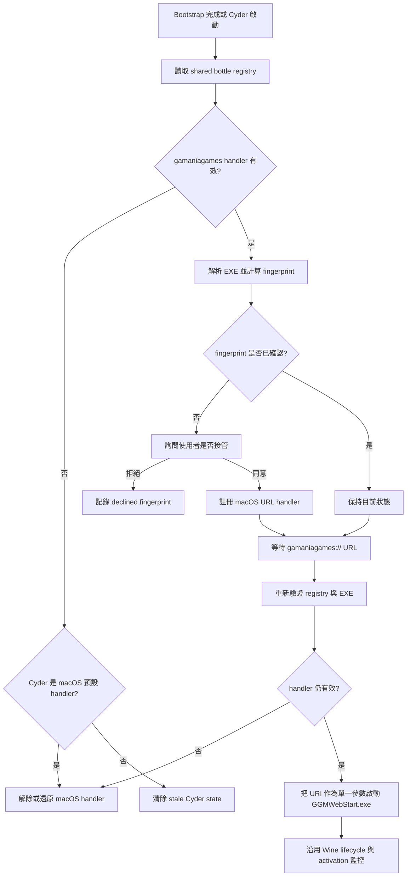

# Cyder `gamaniagames://` URL Handler 設計

> 狀態：設計文件，尚未實作
>
> 目標版本：待排入 Cyder app release；不修改 Wine engine
>
> 更新日期：2026-08-17

## 目的

當 Windows 版 gamania Games Manager 安裝在 Cyder shared bottle 後，Cyder 可選擇
接管 macOS 的 `gamaniagames://` URL scheme。使用者確認後，瀏覽器或其他 macOS
程式開啟此 URL 時，Cyder 讀取 bottle registry 的 Windows URL handler，啟動對應
的 `GGMWebStart.exe`，並把原始 URI 作為單一 Windows 參數傳入。

Cyder 不應預設接管 URL scheme，也不應把 `GGMWebStart.exe` 路徑硬編碼成唯一答案。
Windows registry 是安裝狀態的來源；macOS Launch Services 只負責把 URL 送到 Cyder。

## 現況與實測資料

目前 shared bottle：

```text
~/Library/Application Support/Cyder/bottles/shared
```

目前的 [system.reg](</Users/jjc/Library/Application Support/Cyder/bottles/shared/system.reg:11582>)
已包含：

```text
[Software\\Classes\\gamaniagames]
@="URL:gamania Games Manager Protocol"
"URL Protocol"=""

[Software\\Classes\\gamaniagames\\DefaultIcon]
@="C:\\Program Files\\gamania Games\\gamania Games Manager\\GGMWebStart.exe,0"

[Software\\Classes\\gamaniagames\\shell\\open\\command]
@="\"C:\\Program Files\\gamania Games\\gamania Games Manager\\GGMWebStart.exe\" \"%1\""
```

目前也有安裝 metadata：

```text
[Software\\gamaniaGamesManager]
"InstallPath"="C:\\Program Files\\gamania Games\\gamania Games Manager"
"Version"="1.5.0.2"
```

以及實際檔案：

```text
bottles/shared/drive_c/Program Files/
  gamania Games/gamania Games Manager/GGMWebStart.exe
```

在目前 Wine registry layout 中，machine-level `Software\\Classes` 儲存在
`system.reg`。未來仍須同時支援 `user.reg` 的 per-user handler；若同一 key 同時
存在，Windows 語意以 HKCU 優先於 HKLM。

## 名詞

| 名稱 | 定義 |
|------|------|
| Windows URI registration | bottle registry 中 `Software\\Classes\\gamaniagames` 的 URL handler |
| macOS URL registration | Cyder.app 的 `CFBundleURLTypes` 宣告與 Launch Services 預設 handler |
| handler command | registry 的 `shell\\open\\command` 預設值 |
| installation fingerprint | 由安裝路徑、版本與 handler command 正規化後計算的 SHA-256 識別值 |
| URI handler state | Cyder 在 support directory 保存的偵測、同意與 macOS 綁定狀態 |

Fingerprint 不是安全簽章，只用來辨識「是否為同一個已確認過的安裝」。

## 整體流程



## 1. 偵測 Windows URI registration

### 觸發時機

偵測不應只在每次 URL 開啟時執行。應在以下時機執行：

1. Cyder 啟動且 shared bottle 已完成 bootstrap。
2. gamania Games Manager 安裝流程完成後。
3. shared bottle 的 wineserver 已停止後，進行一次延遲 rescan。
4. 收到 `gamaniagames://` URL 前，再做一次快速驗證。

安裝程式可能在 wineserver 尚未 flush registry 時結束。安裝完成流程必須先等待
對應 prefix 的 registry 寫入完成，再進行 fingerprint 計算。

### Registry 來源與優先順序

第一版使用目前 bottle 既有 registry 檔，不為單次偵測啟動 `wine reg query`：

1. 讀取 `user.reg` 的 `Software\\Classes\\gamaniagames`。
2. 讀取 `system.reg` 的 `Software\\Classes\\gamaniagames`。
3. user-level 值覆蓋 machine-level 值。
4. 只接受 Wine registry parser 能完整解析的簡單字串值。
5. 解析失敗時標記為 unsupported，不猜測 command，也不執行原始字串。

這避免在一般 URL 偵測時建立額外 Wine client。若 registry 正在被安裝程式修改，
延後到 installer lifecycle 完成後再讀取。

### 有效性條件

handler 必須同時符合：

- key `Software\\Classes\\gamaniagames` 存在。
- value `URL Protocol` 存在。
- `shell\\open\\command` 的預設值存在。
- command 是一個可解析的 Windows EXE 路徑，加上 `%1` 參數。
- EXE 路徑解析後位於允許的 bottle Windows drive mapping。
- 對應 macOS 檔案存在且是 regular file。
- 檔案副檔名為 `.exe`。

第一版只接受簡單格式：

```text
"<absolute-windows-exe-path>" "%1"
```

含有 `cmd.exe /c`、PowerShell、批次檔、未解析環境變數、額外 shell operator 或
多段不可驗證 command 的 registration 一律標記為 unsupported，不直接執行。

### Windows path 解析

目前 `C:\...` 路徑可映射到：

```text
<prefix>/drive_c/...
```

解析器必須：

- 將 Windows `\\` 轉為 `/`。
- 正規化大小寫與 `.`／`..`。
- 拒絕跳出 prefix 的路徑。
- 不把 registry 的 `Z:` 或其他 host path 直接視為可信執行檔。
- 以 `resolvingSymlinksInPath()` 後的實際路徑再次檢查允許範圍。

## 2. Installation fingerprint 與同意狀態

### Fingerprint 輸入

從有效 registration 取出以下欄位：

```text
scheme=gamaniagames
installPath=C:\\Program Files\\gamania Games\\gamania Games Manager
version=1.5.0.2
command="C:\\Program Files\\gamania Games\\gamania Games Manager\\GGMWebStart.exe" "%1"
```

正規化規則：

- key name 與 scheme 使用小寫。
- Windows path 使用 `\\`、移除多餘空白與 `.`／`..`。
- command 僅正規化空白與 path 大小寫，不移除 `%1`。
- 欄位以固定順序、UTF-8、LF 組合。
- 對組合結果計算 SHA-256。

例如：

```text
scheme=gamaniagames
install-path=c:\\program files\\gamania games\\gamania games manager
version=1.5.0.2
command="c:\\program files\\gamania games\\gamania games manager\\ggmwebstart.exe" "%1"
```

Fingerprint 變更代表安裝可能被更新、搬移、重裝或改寫 handler；必須重新驗證並
重新詢問，而不是沿用舊同意。

### 建議 state file

位置：

```text
~/Library/Application Support/Cyder/uri-handlers/gamaniagames.json
```

建議格式：

```json
{
  "schemaVersion": 1,
  "scheme": "gamaniagames",
  "prefix": "/Users/jjc/Library/Application Support/Cyder/bottles/shared",
  "fingerprint": "<sha256>",
  "installPath": "C:\\Program Files\\gamania Games\\gamania Games Manager",
  "version": "1.5.0.2",
  "windowsCommand": "\"C:\\Program Files\\gamania Games\\gamania Games Manager\\GGMWebStart.exe\" \"%1\"",
  "resolvedExecutable": "/.../bottles/shared/drive_c/Program Files/gamania Games/gamania Games Manager/GGMWebStart.exe",
  "consent": "accepted",
  "macOSHandler": "local.cyder.app",
  "previousMacOSHandler": null,
  "updatedAt": "2026-08-17T00:00:00Z"
}
```

`consent` 值：

| 值 | 行為 |
|------|------|
| `unknown` | 尚未詢問 |
| `accepted` | 已同意 Cyder 接管 |
| `declined` | 使用者拒絕；同一 fingerprint 不重複詢問 |
| `stale` | registry 或 EXE 已失效 |
| `unsupported` | registry command 無法安全解析 |

state file 只保存 handler metadata，不保存 URI、帳號、OTP 或 query payload。

### 使用者提示

提示應明確說明：

```text
Cyder 偵測到 gamania Games Manager 已註冊 gamaniagames://。
是否讓 Cyder 接收此網址，並使用 GGMWebStart.exe 啟動遊戲？
```

按鈕：

- `允許並設為預設`
- `稍後再說`

只有使用者按下允許後，才呼叫 macOS default handler API。

## 3. 向 macOS 註冊 URL scheme

### Bundle 宣告

`create-cyder-app.sh` 產生的 `Info.plist` 新增：

```xml
<key>CFBundleURLTypes</key>
<array>
  <dict>
    <key>CFBundleURLName</key>
    <string>gamania Games Manager Protocol</string>
    <key>CFBundleURLSchemes</key>
    <array>
      <string>gamaniagames</string>
    </array>
    <key>CFBundleTypeRole</key>
    <string>Viewer</string>
  </dict>
</array>
```

AppKit 要求 app 在 `Info.plist` 宣告支援的 URL types，才能接收 URL open event；
正式 handler 應實作 `application(_:open:)`。參考 [Apple NSApplicationDelegate URL 開啟文件](https://developer.apple.com/documentation/appkit/nsapplicationdelegate/application%28_%3Aopen%3A%29?changes=_7&language=objc)。

### Default handler

正式版直接在 `CyderSwift` 內呼叫 `LSSetDefaultHandlerForURLScheme`，不依賴使用者
安裝 Command Line Tools，也不在 runtime 執行 `swift -e`。呼叫後使用
`LSCopyDefaultHandlerForURLScheme` 驗證結果，並將 OSStatus 寫入 diagnostics。

使用的 bundle ID 必須與 app 的 `CFBundleIdentifier` 相同，目前是：

```text
local.cyder.app
```

`LSSetDefaultHandlerForURLScheme` 的用途是設定使用者對指定 scheme 的偏好 handler；
URL handler 能力仍由 `CFBundleURLTypes` 決定。參考 [Apple LSSetDefaultHandlerForURLScheme 文件](https://developer.apple.com/documentation/coreservices/1447760-lssetdefaulthandlerforurlscheme?preferredLanguage=occ)。

### 既有 handler 的保存與解除

在 Cyder 接管前先讀取目前 default handler：

```text
previousMacOSHandler = LSCopyDefaultHandlerForURLScheme("gamaniagames")
```

解除規則：

1. 只有目前 default handler 是 `local.cyder.app` 時，Cyder 才能執行解除或還原。
2. 若 `previousMacOSHandler` 存在，優先還原該 bundle ID。
3. 若沒有 previous handler，使用經 macOS 版本驗證過的 `None` fallback；若 OSStatus
   失敗，只清除 Cyder state 並顯示無有效 Windows handler，不可覆蓋其他 app。
4. 不從 `Info.plist` 移除 `CFBundleURLTypes`；這是 app 能力宣告，不是使用者同意狀態。

## 4. 收到 URI 後啟動 GGMWebStart.exe

### AppKit event

新增 URL event handler：

```swift
func application(_ application: NSApplication, open urls: [URL])
```

處理規則：

- 只接受 scheme 精確等於 `gamaniagames`，比較時使用小寫。
- 保留 URL 的完整原始字串，作為單一 Windows argument。
- 不把 host、path、query 拆成 shell command。
- 不將 URI 寫入一般 diagnostics 或 launch summary；必要時只記錄 scheme、長度與
  fingerprint。
- 多個 URL 事件依序排入現有 launch queue。

### Primary instance forwarding

現有 `CyderInstanceCoordinator` 已能將 secondary instance 的 EXE 與 argv 送給
primary。URL request 應擴充相同的 request contract：

```json
{
  "files": [],
  "arguments": [],
  "urls": ["gamaniagames://..."],
  "showUI": false
}
```

規則：

- 只有 primary instance 可以啟動 Wine。
- secondary 收到 URL 後寫入 request file、發送 distributed notification、回覆
  LaunchServices，再結束。
- primary 消費 request 後重新驗證 handler，將 URI 加入 queue。
- Cyder 已在背景監控 Wine 時，不建立第二個 menu bar item。

### Launch command

Windows registry command：

```text
"C:\\Program Files\\gamania Games\\gamania Games Manager\\GGMWebStart.exe" "%1"
```

解析後轉為現有 launcher 的結構化 argv：

```text
exe = <resolved bottle path>/GGMWebStart.exe
args[0] = 原始 gamaniagames:// URI
```

使用現有 `runWineThroughLauncher()`／`cyder_launcher.sh --launch-exe` 路徑，讓
GGMWebStart.exe 享有相同的：

- Wine prefix 與 engine 選擇
- graphics／locale／sync 設定
- detached lifecycle sidecar
- `status=0` launcher handoff 判定
- Wine activation forwarding

## 5. URI 開啟時的失效處理

收到 URI 後必須重新讀取 registry，不能只相信 state file。以下任一情況視為 stale：

- `gamaniagames` key 消失。
- `URL Protocol` 消失。
- `shell\\open\\command` 消失或格式不受支援。
- command 指向的 EXE 不存在。
- EXE 路徑解析後超出 bottle 允許範圍。
- fingerprint 與 state 不同且尚未重新取得使用者同意。

處理：

1. 不啟動 Wine。
2. 若 Cyder 是目前 macOS default handler，還原 previous handler 或執行解除流程。
3. 將 state 標記為 `stale`。
4. 顯示：

   ```text
   找不到 gamania Games Manager。
   請重新安裝遊戲橘子啟動器，或在 Cyder 遊戲庫重新指定 GGMWebStart.exe。
   ```

5. 使用者重新安裝後產生新 fingerprint，才再次詢問接管。

## 6. 安全與可靠性限制

- 不執行 registry 的任意 command line；第一版只允許單一 `.exe` 加 `%1`。
- 不把 URI 經過 shell 字串插值；必須使用 Swift／Bash argv array。
- 不把 URI、query、OTP、帳號或 token 寫入 persistent log。
- 只允許使用者確認後設定 macOS default handler。
- 不覆蓋其他 app 的 URL handler。
- bottle 正在執行時不啟動 `wine reg query` 做輪詢。
- handler path 必須重新解析並檢查 symlink，避免 registry 指到任意 host binary。
- 多個 URL 依序處理，不並行啟動多個 GGMWebStart.exe。
- 若 GGMWebStart.exe 已在同一 prefix 執行，保留目前 Wine instance 的行為，第一版不
  額外實作 Windows single-instance IPC。

## 7. 實作範圍

### Cyder app repository

預計修改：

| 檔案 | 工作 |
|------|------|
| `scripts/create-cyder-app.sh` | 加入 `CFBundleURLTypes` |
| `scripts/cyder_app_main.swift` | 接收 URL、驗證、排入 launch queue、顯示提示 |
| `scripts/cyder_instance.swift` | request contract 加入 URL forwarding |
| `scripts/cyder-common.sh` | registry 偵測、command parser、Windows path resolve、fingerprint |
| `scripts/cyder_status_item.swift` | 沿用既有 session，不新增特殊 GGM 狀態 |
| `tests/test-cyder-url-handler.sh` | registry fixture、fingerprint、stale cleanup、command allowlist |
| `tests/test-cyder-open-files-lifecycle.sh` | URL 與 EXE instance forwarding 契約 |
| `tests/test-cyder-app-payload.sh` | URL scheme 進入 packaged Info.plist |
| `docs/cyder.md` | 使用者設定與 URI handler 說明 |

### Wine engine repository

不修改 engine，不新增 Wine patch。Windows registry 由 gamania Games Manager 安裝程式
建立；Cyder 只讀取、驗證並依 registry command 啟動對應 EXE。

## 8. 測試計畫

### 靜態 fixture

建立包含以下資料的最小 bottle fixture：

1. 有效 `gamaniagames` registration。
2. 缺少 `URL Protocol`。
3. 缺少 `%1`。
4. 指向不存在 EXE。
5. `cmd.exe /c` 不受支援 command。
6. user.reg 覆蓋 system.reg。
7. command path 含空白與非 ASCII 字元。
8. fingerprint 只改 version、install path 或 command 的其中一項。

### AppKit／Launch Services

在隔離測試 app 中驗證：

```bash
open 'gamaniagames://maplestory/test'
```

驗收：

- 已同意時由 Cyder 收到 URL。
- Cyder 執行一次 GGMWebStart.exe，URI 維持單一 argv。
- Cyder 已在背景時由 primary instance 接收，不產生第二個 menu bar item。
- 未同意時不會註冊或啟動 Wine。

### 真實 bottle

使用目前 shared bottle 驗證：

- 偵測現有 `1.5.0.2` registration。
- 首次同意後寫入 state file。
- 同一 fingerprint 不重複詢問。
- 改變 version 或 command 後重新詢問。
- 暫時移除 `GGMWebStart.exe` 後顯示找不到並解除 Cyder handler。
- 還原檔案後重新偵測並可重新接管。

### 發布驗收

- `Info.plist` 含 `CFBundleURLTypes`。
- app 使用正式 bundle ID 註冊，不使用測試 bundle ID。
- codesign 後 URL scheme 仍存在。
- notarization 通過。
- `open 'gamaniagames://...'` 可啟動正式 Cyder.app。
- 不影響既有 `.exe` open-file、dynamic argv、primary instance 與背景 activation。

## 9. 不納入第一版

- 不支援任意 Windows registry command line。
- 不支援多個相同 scheme 的 GGM 安裝自動選擇；若偵測到衝突，要求使用者選擇或顯示
  不支援。
- 不在 Cyder 中解析 gamania URI 的業務欄位；完整 URI 交給 GGMWebStart.exe。
- 不修改 Windows registry 的 handler。
- 不新增隱藏 process monitor；沿用現有 lifecycle sidecar 與 prefix-level wineserver
  drain。
- 不把這個功能擴張成通用 Windows protocol bridge；先限定 `gamaniagames`。

## 完成定義

功能只有在以下條件全部成立時才可發布：

1. Cyder 能從 bottle registry 安全找出有效 `GGMWebStart.exe`。
2. 使用者未同意前，Cyder 不成為 macOS default handler。
3. 同一 fingerprint 不重複詢問；安裝變更會重新驗證。
4. 收到 URI 時只由 primary Cyder instance 啟動 Wine。
5. URI 作為單一 argv 傳給 GGMWebStart.exe，不經 shell 重新組字串。
6. handler 或 EXE 失效時不啟動 Wine，顯示錯誤並清理 Cyder 的 macOS handler。
7. 既有 `.exe` 啟動、dynamic argv、lifecycle、activation forwarding 與 menu bar 行為
   全部回歸通過。
