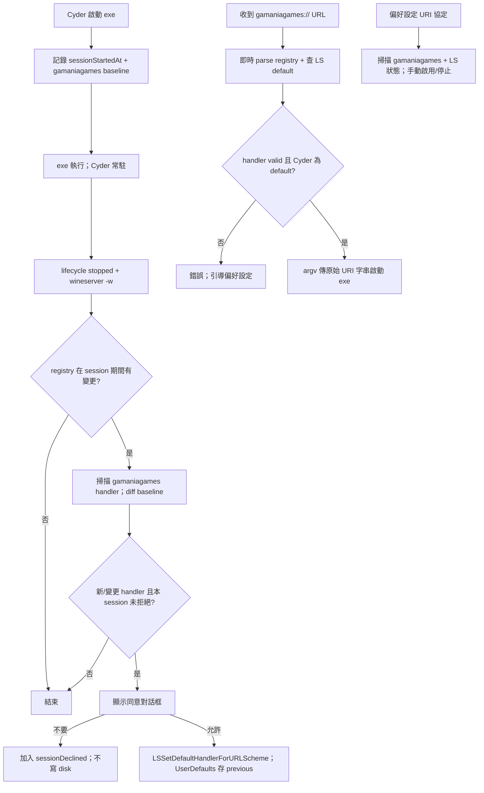

# Cyder `gamaniagames://` URL Handler 設計

> 狀態：設計文件，尚未實作
>
> 目標版本：待排入 Cyder app release；不修改 Wine engine
>
> 平台：第一版僅支援 **macOS 11+**（需 CyderSwift AppKit 路徑；Catalina 10.15 不納入）
>
> Scheme 範圍：第一版**僅** `gamaniagames://`（不含 `nexonplug` 或其他 scheme）
>
> 更新日期：2026-08-17

## 目的

當 gamania Games Manager 在 Cyder shared bottle 註冊 `gamaniagames://` 後，Cyder
可選擇接管 macOS 的同名 scheme。使用者確認後，瀏覽器開啟此 URL 時，Cyder 讀取
bottle registry 的 Windows URL handler，啟動對應 `.exe`，並把**完整原始 URI 字串**
（含 `%20` 等 percent-encoding，**不解碼**）作為單一 Windows 參數傳入。

典型安裝流程：Finder 以 Cyder 開啟 GGM 安裝 `.exe`；Cyder 在 exe 執行期間保持
常駐；安裝完成後 installer 寫入 registry；exe lifecycle 結束時 Cyder 偵測到新
registration 並詢問是否接管。

Cyder 不硬編碼 `GGMWebStart.exe` 路徑；Windows registry 是安裝狀態的來源，
macOS Launch Services 只負責把 URL 送到 Cyder。

## 現況與實測資料

shared bottle：

```text
~/Library/Application Support/Cyder/bottles/shared
```

測試 fixture：`tests/fixtures/url-handler/gamaniagames/`。`system.reg` 片段：

```text
[Software\\Classes\\gamaniagames]
@="URL:gamania Games Manager Protocol"
"URL Protocol"=""

[Software\\Classes\\gamaniagames\\shell\\open\\command]
@="\"C:\\Program Files\\gamania Games\\gamania Games Manager\\GGMWebStart.exe\" \"%1\""
```

Wine section 含 timestamp suffix：`[Software\\Classes\\gamaniagames] 1740000000`。
parser 須同時讀取 section path 與行尾 timestamp（Unix epoch），供 session diff 使用。

user-level 在 `user.reg`；HKCU 優先於 HKLM。

## 名詞

| 名稱 | 定義 |
|------|------|
| Windows URI registration | bottle registry 中 `Software\Classes\gamaniagames` 的 URL handler |
| macOS URL registration | `CFBundleURLTypes` + Launch Services default handler |
| handler command | `shell\open\command` 預設值 |
| Wine session | 一次 Cyder 啟動 exe 至 lifecycle `stopped` 的區間 |
| session baseline | session 開始當下掃描到的 `gamaniagames` handler（`windowsCommand`） |

## 決策紀錄

| 項目 | 決策 |
|------|------|
| 平台 | macOS 11+ only |
| Scheme 範圍 | 僅 `gamaniagames://` |
| URI 傳遞 | `url.absoluteString` 原樣傳入 argv；`%20` 等 **不解碼** |
| 自動詢問觸發 | Wine session 結束；registry 在 session 期間有變更且出現新的 valid handler |
| 持久化 | 無 state file；macOS LS 為 accepted 來源；UserDefaults 僅存 `previousMacOSHandler` |
| 拒絕後行為 | 同 session 記憶；跨 session 靠 registry 未變更 → 不掃描、不問 |
| 偏好設定 | 第一版一併實作 URI 協定面板（僅 `gamaniagames`） |
| registry 讀取 | 直接 parse `.reg`；不跑 `wine reg query` |
| handler 解除 | 有 `previousMacOSHandler` 則還原；否則只停止 Cyder 邏輯 |

## 整體流程



## 1. 偵測觸發：session diff（無持久化 state file）

### 1.1 核心想法

Cyder 在 Wine exe 執行期間本來就常駐。因此：

1. **Session 開始**（`runWineThroughLauncher` 成功、shared prefix）：  
   - 記錄 `sessionStartedAt`（Unix time）  
   - 記錄 `system.reg`／`user.reg` 的 mtime  
   - 建立 **baseline**：當下 `gamaniagames` 的 `windowsCommand`（若不存在則 `nil`）

2. **Session 結束**（lifecycle `stopped`）：  
   - 若兩個 `.reg` 的 mtime **皆** ≤ session 開始時 mtime，且 `gamaniagames`
     section timestamp ≤ `sessionStartedAt` → **跳過掃描**（cheap exit）  
   - 否則重新掃描 `gamaniagames`  
   - 若 handler `status=valid` 且 `windowsCommand` 與 baseline 不同（或 baseline
     為空）→ 若不在 `sessionDeclined` → **自動詢問**

3. **Cyder 啟動時**：不主動詢問；偏好設定面板開啟時才掃描。

4. **收到 URL 時**：即時 parse + `LSCopyDefaultHandlerForURLScheme("gamaniagames")`；
   不跳同意框。非 `gamaniagames` scheme 一律忽略。

### 1.2 為何可以不要 state file

| 需求 | 作法 |
|------|------|
| 使用者已同意 | `LSCopyDefaultHandlerForURLScheme("gamaniagames") == local.cyder.app` |
| 使用者按「不要」 | registry 未變 → mtime／timestamp 不變 → 不掃描；同 session 用 `sessionDeclined` |
| 重裝／升級 | registry 變 → 再問 |
| 啟動哪個 exe | 收到 URL 時即時 parse |
| 還原 previous handler | UserDefaults `uriHandler.previous.gamaniagames` |

### 1.3 記憶體內 session 狀態

```swift
struct CyderURISessionState {
    let sessionStartedAt: TimeInterval
    let regMtimeAtStart: (system: Date, user: Date)
    let baselineCommand: String?   // gamaniagames windowsCommand at session start
    var sessionDeclined: Bool      // 本 session 已按「不要」
}
```

### 1.4 邊界情況

| 情況 | 行為 |
|------|------|
| 同 session 連續開兩個 exe，registry 已在第一個 exe 期間寫入 | 第一個 exe 結束時問；第二個 exe 結束 diff 為空 → 不問 |
| CLI `cyder_launcher.sh` 啟動、無 Swift lifecycle | 不觸發自動詢問；改從偏好設定手動啟用 |
| registry mtime 變但非 gamaniagames section | cheap filter 仍可能觸發掃描；diff 為空 → 不問 |
| GGM 解除安裝 | 收到 URL 時 parse 失敗；偏好設定可「停止 Cyder 處理」 |

## 2. Registry 掃描

### 範圍

scanner **只**讀取 `Software\Classes\gamaniagames`（user.reg 優先於 system.reg）。
bottle 內其他 scheme（如 `nexonplug`）第一版**不掃描、不顯示、不接收**。

### 有效性條件

- `URL Protocol` 存在  
- `shell\open\command` 為 `"<absolute-path>" "%1"`  
- EXE 在 bottle `drive_c/` 內、存在、為 `.exe`  
- 不接受 `cmd.exe`／PowerShell／批次檔

### Section timestamp

```json
{
  "scheme": "gamaniagames",
  "sectionTimestamp": 1740000000,
  "windowsCommand": "...",
  "resolvedExecutable": "...",
  "installPath": "C:\\...",
  "version": "1.5.0.2",
  "status": "valid"
}
```

### CLI

```bash
cyder_scan_uri_handlers "$prefix" --scheme gamaniagames [--changed-since EPOCH]
```

### Windows path 解析

`C:\...` → `<prefix>/drive_c/...`；正規化、`..` 拒絕、symlink 再檢查。

## 3. 同意與偏好設定

### 自動詢問對話框

```text
Cyder 偵測到 gamania Games Manager 已註冊 gamaniagames://。
是否讓 Cyder 接收此網址，並使用 GGMWebStart.exe 啟動遊戲？
```

按鈕：

- `允許並設為預設` → `LSSetDefaultHandlerForURLScheme("gamaniagames", ...)`；
  UserDefaults 存 previous handler（若當時非 Cyder）
- `不要` → `sessionDeclined = true`

### 偏好設定：URI 協定（第一版必做）

位置：**Cyder 設定 → URI 協定**。

僅顯示 `gamaniagames`（若 registry 有 valid handler）：

| 欄位 | 來源 |
|------|------|
| scheme | `gamaniagames` |
| 目標 exe | `resolvedExecutable` 檔名 |
| 版本 | `Software\gamaniaGamesManager\Version`（若有） |
| macOS 狀態 | `LSCopyDefaultHandlerForURLScheme("gamaniagames")` 是否為 Cyder |

操作：**重新掃描**、**設為 Cyder 處理**、**停止 Cyder 處理**。

## 4. macOS URL scheme 註冊

### Info.plist

第一版只宣告 `gamaniagames`：

```xml
<key>CFBundleURLTypes</key>
<array>
  <dict>
    <key>CFBundleURLName</key>
    <string>gamania Games Manager Protocol</string>
    <key>CFBundleURLSchemes</key>
    <array>
      <string>gamaniagames</string>
    </array>
    <key>CFBundleTypeRole</key>
    <string>Viewer</string>
  </dict>
</array>
```

App 更新後呼叫 `LSRegisterURL`／`lsregister -f`（見 `cyder-exe-association.swift`）。

### UserDefaults（唯一持久化）

```text
uriHandler.previous.gamaniagames = "com.other.app"
```

### 解除規則

1. 只有目前 default 是 `local.cyder.app` 時 Cyder 才還原。  
2. 有 previous → `LSSetDefaultHandlerForURLScheme("gamaniagames", previous)`。  
3. 無 previous → 不嘗試 None fallback；引導系統設定。  
4. 不從 Info.plist 移除 URL types。

## 5. 收到 URI 後啟動 exe

### AppKit

```swift
@available(macOS 11.0, *)
func application(_ application: NSApplication, open urls: [URL])
```

只處理 `url.scheme?.lowercased() == "gamaniagames"` 的項目；其餘忽略。

### URI 字串傳遞（不解碼）

Windows `%1` 必須收到與 macOS 傳入 Launch Services **相同的字面字串**。
Cyder 使用 `url.absoluteString` 作為 `args[0]`，**不得**對 percent-encoding
做 decode（例如 `%20` 必須維持 `%20`，不可變成空格）。

實測範例（`;`、`&&&&` 分隔，長 hex `Data`；diagnostics **不**記錄完整 URI）：

```text
gamaniagames://Region=TW;Production&&&&SN=8d7e7abd-5b8b-424a-b1d3-8bcf6d04ff65&&&&Cmd=06006&&&&Data=0032eb768a396ee2f1b32a5a2cc12c8c53f3d9c10816d0ace9b6ad3835bb9d8c1fb404148ae6c243b1c7d488f0c14b9792be07c23de36cf1bc99f1921dd0e4003b355c068b2084238b65f36f35f41c572b0d6c6327d8280175640998691e610bb47bba11ade7478dbc139a64fc8e91a207ac99aa178df86ba7ebafaa799a88260c256988d1da2f1e6f3bbfe265b08bfac61c7334a80cc75790e59852bfa57093cd851783e1d6d3fd895d506bbb650c1c96a0cbfa617e1088e26523e512272cdda36c1c9010b468ab17108852184ae643cac2c412f1564f1021181cb1f931e1ab0a2b25fdc87f1cc3036c5f4754eb86a10e573af2a6f1126d4457555bb95f2da2872953780df7b8753da3fbe5e22ce7d40ac796ee7
```

若 URI 中含 `%20` 等 encoding，同樣原樣保留。

傳遞路徑：

- Swift → bash launcher：**argv array**，不經 shell 插值  
- `;`、`&` 等字元不得被 shell 重新解釋  
- diagnostics 只記 `scheme=gamaniagames`、URI **長度**、exe 檔名

若實測發現 `absoluteString` 會改變 encoding，改從 Apple Event 取 raw string；
第一版以 `absoluteString` 為預設，以上述長 URI 與含 `%20` 的變體驗證。

### 啟動條件

1. `LSCopyDefaultHandlerForURLScheme("gamaniagames") == local.cyder.app`  
2. registry parse 為 `valid`  
3. primary instance

### Cold start / bootstrap

URL 在 bootstrap 前送達 → deferred queue；bootstrap 完成後再驗證並啟動。

### Primary instance forwarding

```swift
struct CyderInstanceRequest {
    let files: [String]
    let arguments: [String]?
    let urls: [String]   // 僅 gamaniagames://
    let showUI: Bool
}
```

### Launch

```text
exe = registry 解析的 GGMWebStart.exe（或等效 handler exe）
args[0] = url.absoluteString   // 原樣，不解碼
```

## 6. 失效處理

1. 不啟動 Wine  
2. 若 Cyder 為 default 且有 UserDefaults previous → 嘗試還原  
3. 顯示：

   ```text
   找不到 gamania Games Manager。
   請重新安裝遊戲橘子啟動器，或在 Cyder 設定 → URI 協定 檢查。
   ```

## 7. 安全限制

- 僅允許單一 `.exe` + `%1` command  
- URI 走 argv；不 log 完整 payload  
- 只接收 `gamaniagames` scheme  
- symlink 檢查、多 URL 依序處理

## 8. 實作範圍

| 檔案 | 工作 |
|------|------|
| `scripts/create-cyder-app.sh` | `CFBundleURLTypes`（僅 gamaniagames） |
| `scripts/cyder-common.sh` | `.reg` parser、`cyder_scan_uri_handlers --scheme gamaniagames` |
| `scripts/cyder_uri_handler.swift`（新建） | session diff、LS API、UserDefaults |
| `scripts/cyder_app_main.swift` | session hook、`application(_:open:)`、提示 |
| `scripts/cyder_instance.swift` | `urls` forwarding |
| `scripts/cyder_settings_ui.swift` | URI 協定面板 |
| `scripts/cyder_status_item.swift` | lifecycle `stopped` → session end scan |
| `tests/test-cyder-url-handler.sh` | fixture、timestamp diff、encoding |
| `tests/test-cyder-open-files-lifecycle.sh` | URL forwarding |
| `tests/test-cyder-app-payload.sh` | Info.plist |
| `docs/cyder.md` | 使用者說明 |

## 9. 測試計畫

### Fixture

- valid／invalid `gamaniagames` registration  
- section timestamp diff；mtime 未變 → 不掃描  
- sessionDeclined 同 session 不重問  
- URI 含 `%20` → argv 仍為 `%20`（不解碼）

### 實機（macOS 11+）

```bash
open 'gamaniagames://Region=TW;Production&&&&SN=test&&&&Cmd=06006&&&&Data=abc'
```

- lifecycle 結束後詢問一次  
- 按「不要」→ reg 未變不再問；偏好設定可手動啟用  
- primary forward、bootstrap defer  
- 長 URI argv 完整性（可 mock GGMWebStart 或檢查 launcher argv log）

## 10. 不納入第一版

- macOS 10.15  
- `nexonplug://` 及其他 scheme  
- 任意 registry command  
- 解析 URI 業務欄位  
- 修改 Windows registry  

## 完成定義

1. session 結束且 `gamaniagames` registry 有變更 → 自動詢問。  
2. 無 state file；accepted 由 macOS LS 決定。  
3. URI 以 `absoluteString` 原樣傳入；`%20` 不解碼。  
4. 僅處理 `gamaniagames://`。  
5. macOS 11+ 實機驗證通過。  
6. 既有 EXE 啟動與 lifecycle 回歸通過。
