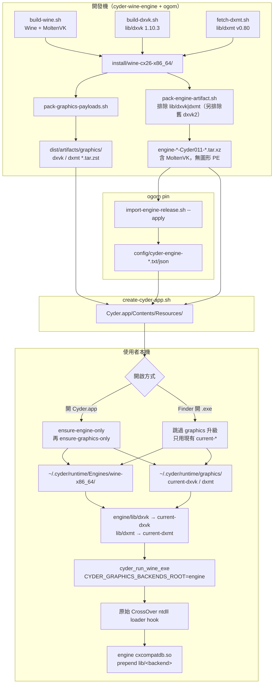
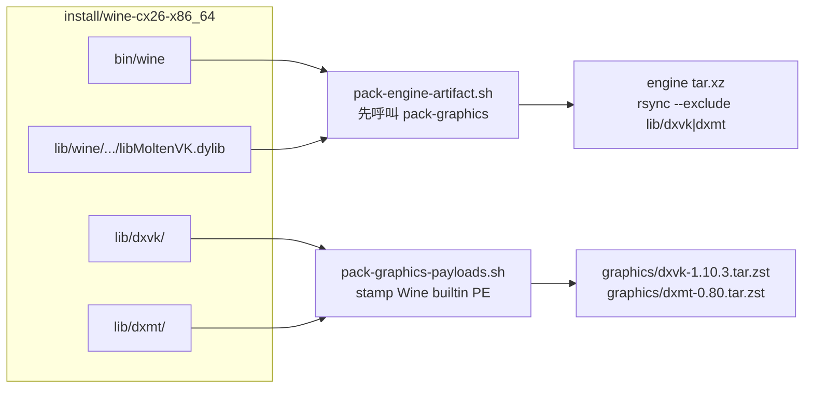
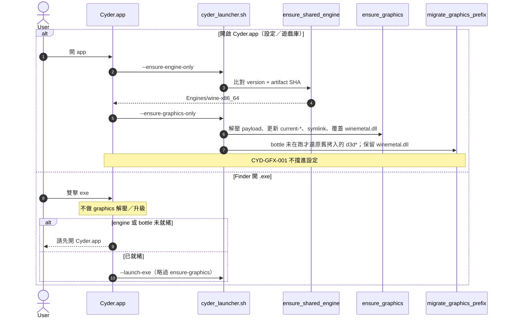
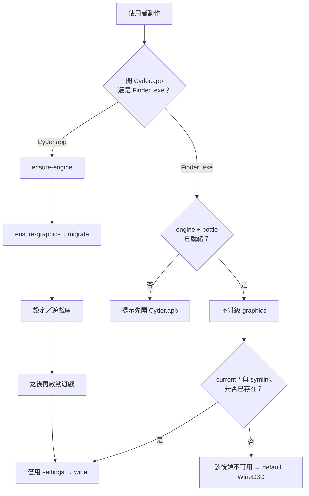

# 引擎、圖形轉譯層與 Runtime 載入

> 對象：開發／發布。說明 **Wine engine**、**DXVK／DXMT payload**、
> **MoltenVK** 與獨立 **`cxcompatdb.so` prepend runtime** 如何分開安裝、再在啟動時接起來。
> 使用者選項見 [圖形後端](cyder-graphics-backends.zh-TW.md)；編譯細節見
> [DXVK 編譯備忘](build-dxvk.zh-TW.md)；engine 專案邊界見
> [Wine engine 專案](cyder-wine-engine-project.md)。

三件事不要混在一起：

| 層 | 是什麼 | 打進哪 | 本機落點 |
|----|--------|--------|----------|
| **Engine** | Wine + MoltenVK + media；**不含** DXVK／DXMT PE | `Resources/engine-*.tar.xz` | `~/.cyder/runtime/Engines/wine-x86_64/` |
| **Graphics payload** | DXVK 1.10.3、DXMT v0.80 的 PE（+ DXMT `winemetal.so`） | `Resources/graphics/*.tar.zst` | `~/.cyder/runtime/graphics/` |
| **Runtime 載入** | 原始 CrossOver ntdll hook 載入 `cxcompatdb.so`，由 plugin 執行 CompatDB **builtin + prepend**；bottle 內 `d3d*` 維持 Wine 內建 | engine 內 `lib/wine/x86_64-unix/cxcompatdb.so` | 程序環境變數 + engine `lib/{dxvk,dxmt}` symlink |

GPTK／D3DMetal 不隨 app 出貨，不在這三層裡。

---

## 1. 總覽



重點：**圖形 PE 先從 install 樹打成獨立 archive，再從 engine tar 剔除。**
Runtime 用 symlink 把兩份貨接成 CompatDB 認得的 `ENGINE/lib/<token>` 布局。
MoltenVK 必須留在 engine，因為 DXVK 家族的可用性檢查讀的是
`lib/wine/x86_64-unix/libMoltenVK.dylib`（或 `lib64/libMoltenVK.dylib`）。

---

## 2. 開發機：編譯與打包

Install 樹同時有 Wine 與圖形 PE，只為了本機測試與打包來源。出貨拆成兩個 artifact。



| 腳本 | 做什麼 |
|------|--------|
| `scripts/build-wine.sh` | 在 **cyder-wine-engine** 建 Wine，並編譯獨立 `cxcompatdb.so`；不修改 CrossOver 原始 ntdll |
| `scripts/build-dxvk.sh` | 1.10.3 → `lib/dxvk`；寫 `version`；stamp `"Wine builtin DLL"` |
| `scripts/fetch-dxmt.sh` | 上游 v0.80 → `lib/dxmt` |
| `scripts/pack-graphics-payloads.sh` | 從上述兩棵樹打 zstd + `*-version.txt` + `*-artifact-sha256.txt` |
| `scripts/pack-engine-artifact.sh` | **先** pack graphics，確認 `cxcompatdb.so` 存在且相容，再 stage engine 並排除兩棵圖形樹 |
| `scripts/import-engine-release.sh --apply` | 驗證 manifest／NTDLL SHA，寫入 `config/cyder-engine-*` |
| `scripts/create-cyder-app.sh` | 複製 pin 住的 engine tar **與** DXVK／DXMT graphics sidecar；缺一則失敗（`CYDER_ALLOW_MISSING_GRAPHICS=1` 除外） |

Engine 升級（例如 `Cyder011`）會更新 Wine 與 engine 內的
`cxcompatdb.so`；圖形 payload 版本仍由 `lib/*/version` 與 sidecar 獨立演進。

---

## 3. App 內貨源與本機 runtime 布局

```text
Cyder.app/Contents/Resources/
  engine-<label>.tar.xz              # 或 engine-archive.txt 指向的檔名
  engine-version.txt
  graphics/
    dxvk-1.10.3.tar.zst
    dxvk-version.txt                 # 1.10.3
    dxvk-artifact-sha256.txt
    dxmt-0.80.tar.zst
    dxmt-version.txt
    dxmt-artifact-sha256.txt

~/.cyder/runtime/
  Engines/wine-x86_64/               # 解壓後的 Wine + MoltenVK
    bin/wine
    lib/wine/x86_64-unix/libMoltenVK.dylib
    lib/wine/x86_64-unix/cxcompatdb.so # CompatDB policy plugin
    lib/dxvk  → 相對路徑 ../../../graphics/current-dxvk
    lib/dxmt  → ../../../graphics/current-dxmt
  graphics/
    dxvk/1.10.3/                     # 解壓內容（含 x86_64-windows/d3d11.dll）
    dxmt/0.80/
    current-dxvk  → dxvk/1.10.3
    current-dxmt  → dxmt/0.80

~/Library/Application Support/Cyder/bottles/shared/
  drive_c/windows/system32/winemetal.dll  # DXMT x86_64-windows PE
  drive_c/windows/syswow64/winemetal.dll  # DXMT i386-windows PE
```

`cyder-ensure-graphics.sh`：比對 sidecar version 與
`graphics/<name>/<ver>/.cyder-graphics-version`；不同才解壓。然後原子更新
`current-*`，把 engine `lib/<name>` 換成**相對** symlink，並以該次 DXMT
payload 的 `x86_64-windows/winemetal.dll`／`i386-windows/winemetal.dll`
覆蓋目前要啟動的 prefix（shared 或 per-game）的 `system32`／`syswow64`
對應檔案。`winemetal.so` 只留在
engine `lib/dxmt/x86_64-unix/`，不複製進 prefix。
在受管 `CYDER_ENGINES` 外若已是實體目錄，會拒絕 `rm -rf`。

---

## 4. 安裝時序（誰先誰後）



| 步驟 | 腳本／入口 | 條件 |
|------|------------|------|
| 1. 裝／升級 engine | `cyder_ensure_shared_engine` | version 不同，或同版但 SHA 不同 |
| 2. 裝／升級 graphics | `cyder_ensure_graphics` | sidecar version ≠ 已解壓 marker；每次也校正 DXMT `winemetal.dll` |
| 3. 接線 | `lib/dxvk`、`lib/dxmt` → `current-*` | 每次 ensure-graphics |
| 4. DXMT PE gate | `cyder_ensure_dxmt_winemetal_prefix` | 將同版 64/32 位元 `winemetal.dll` 覆蓋 shared 或 per-game prefix；不複製 `winemetal.so` |
| 5. 遷移舊 bottle | `cyder_migrate_graphics_prefix` | 偵測舊 Cyder 拷入的 DXVK／DXMT PE；prefix 使用中則延後，且不刪 `winemetal.dll` |
| 6. Bootstrap bottle | `cyder_bootstrap_shared_prefix` | 開 Cyder 且 marker 未齊；**不再**把 DXVK 拷進 system32 |

`cyder_prepare_graphics_prefix` 在有 graphics 貨源時會先跑 ensure，再開 Cyder
的 `--ensure-graphics-only` 會再跑一次（第二次應是 no-op）。`--launch-exe`
在選定 shared 或 per-game prefix 後也會執行同一個 preparation，確保舊 profile
不會因缺少 `winemetal.dll` 而直接失敗。若是首次建立 prefix，bootstrap 完成後會
再跑一次 ensure，補上建立前不存在、因此無法先安裝的 `winemetal.dll`。

Engine 大版本升級會 `cyder_reset_shared_prefix`；圖形 payload 換版**不會**重做 bottle。

Health check 只驗證 Wine engine、prefix registry／kernel32 與最小 `cmd` probe，
不把可選的 DXVK／DXMT 缺失當成 Windows 環境損壞。圖形後端是否可用由
ensure-graphics 與啟動前 capability gate 個別檢查；DXMT 額外要求兩個 PE 架構的
`winemetal.dll`、`d3d11.dll`、`dxgi.dll` 及 Unix 端 `winemetal.so`。

---

## 5. 啟動時如何載入轉譯層

Bottle 的 `system32`／`syswow64` 維持 Wine 內建 `d3d*`／`dxgi`；唯一的 DXMT
例外是 `winemetal.dll`，它由 ensure-graphics 安裝同版 PE 作為 Wine loader
可見的對應模組。真正換成 DXVK／DXMT
是 **process-local**：Cyder 傳入環境變數，原始 CrossOver ntdll 的 loader hook 載入
`cxcompatdb.so`，再由 plugin 呼叫既有 loader primitive 完成 prepend。

```mermaid
sequenceDiagram
  autonumber
  participant S as settings.json
  participant Sh as cyder_apply_graphics_preference
  participant W as wine / ntdll
  participant C as cxcompatdb.so
  participant FS as ENGINE/lib/&lt;token&gt;

  S->>Sh: graphicsBackend=dxvk
  Sh->>Sh: 有 lib/dxvk/.../d3d11.dll？
  alt payload 在
    Sh->>W: CYDER_GRAPHICS_BACKEND=dxvk
    Sh->>W: DXVK_FRAME_RATE / DXVK_HUD 或 DXMT_CONFIG 限幀
  else 缺失
    Sh->>W: 不設 backend（等同 default）
  end
  W->>W: CYDER_GRAPHICS_BACKENDS_ROOT=engine 根
  W->>C: 讀 CYDER_GRAPHICS_BACKEND
  C->>C: validate backend path / PE / dependency
  C->>FS: root/lib/dxvk + MoltenVK
  alt 模組存在且已 stamp builtin
    C->>C: load-order "b" + prepend_dll_path
    C-->>W: 載入 DXVK PE（位址 ≠ Wine 內建）
  else 不可用
    C-->>W: 回退 wined3d
  end
```

| 變數 | 角色 |
|------|------|
| `CYDER_GRAPHICS_BACKEND` | `dxvk`／`dxmt`／`wined3d`／`d3dmetal`；一般 `default` 交給 CompatDB，兩個 MapleStory executable 的 `default` 由 launcher 依 macOS 版本解析 |
| `CYDER_GRAPHICS_BACKENDS_ROOT` | 設成 **engine 根**（`bin/wine` 的上一層），讓 `lib/%s` 與 MoltenVK 同一棵樹 |
| `CYDER_GRAPHICS_BACKEND_PATH` | 可選；直接指定 backend 目錄。`cxcompatdb.so` 會 canonicalize，檢查目前 PE machine、builtin signature、必要 DLL 與 host dependency，失敗回退 WineD3D |
| `CX_GRAPHICS_BACKEND` | 與上者同步，供既有 CrossOver 相容環境辨識；Cyder plugin 的主控制變數是 `CYDER_GRAPHICS_BACKEND` |
| `DXVK_FRAME_RATE`／`DXVK_HUD` | 僅手動 DXVK（60／120／144） |
| `DXMT_CONFIG` | 僅手動 DXMT；合併 `d3d11.preferredMaxFrameRate` |
| `CYDER_ACTIVE_GRAPHICS_BACKEND_PATH` | plugin 成功後寫入實際 canonical path，供診斷 log／子流程觀察 |

MapleStory 平台策略只在 `cyder_prepare_game_launch_settings` 知道實際 EXE 後
執行：macOS 15+ 優先 DXMT，舊版 macOS 使用 DXVK；payload capability gate
失敗時回退到另一個可用 backend，再由 `cxcompatdb.so` 做最後的模組驗證。

### `cxcompatdb.so` 的責任

- CrossOver 原始 ntdll 的既有 hook 載入它；Cyder 不 patch ntdll，也不改變 ntdll 的 loader mechanism。
- 直接使用 `CYDER_GRAPHICS_BACKEND_PATH` 時，檢查 canonical directory、owner／寫入權限、非 symlink、PE machine、`MZ`／`PE` header 與 `Wine builtin DLL` signature。
- 每個 backend 至少必須提供同一 machine 的 `d3d11.dll` 與 `dxgi.dll`；DXVK 另需 engine 的 MoltenVK，DXMT 需 `winemetal.so`，D3DMetal 需 GPTK `libd3dshared.dylib`。
- 對可用 DLL 設定 load-order `"b"`，再將 backend 目錄交給既有 `prepend_dll_path`；stamp 發生在 build／pack，不是啟動時。
- 成功 log 記錄 backend、PE machine 與實際 canonical path；拒絕時記錄輸入 path 與 WineD3D fallback。
- 它目前處理 current-process append arguments、DLL overrides 與 graphics backend；`set_env`、`unset_env`、executable replacement、WineD3D renderer records 會記錄 unsupported 並忽略，不應當成可用規則發布。

舊版已發布、未內含 `cxcompatdb.so` 的 engine 必須重新打包升級；不能藉由更新
app 端環境變數讓舊 engine 自動取得此 plugin。現行 pin：
`CX26.3.0-W11-Cyder011`。

---

## 6. 兩條啟動路徑對照



Swift：`prepareEnvironmentAndShowSettings` 走完整 ensure；
`runPhasedLaunch`（Finder）只檢查 `environmentState`，**不**呼叫
`--ensure-graphics-only`。缺 payload 時軟提示，仍嘗試啟動。

---

## 7. 責任邊界

| 專案 | 擁有 |
|------|------|
| **cyder-wine-engine** | Wine／MoltenVK 建置、獨立 `cxcompatdb.so`、engine pack（排除圖形樹）、minOS；保留原始 CrossOver ntdll |
| **ogom（Cyder）** | DXVK／DXMT 編譯與 pack、ensure-graphics、設定 UI、CompatDB YAML、app 打包 |

本機 `install/wine-cx26_x86_64` 常是 ogom → engine 的 symlink；**pack／rebuild 仍應在 engine repo** 跑，以免 `.env` 與 minOS 旗標錯位。

---

## 8. 常見斷點

| 症狀 | 先查 |
|------|------|
| DXVK 沒有效果，像 default | Engine 是否含 `lib/wine/x86_64-unix/cxcompatdb.so`（`strings cxcompatdb.so \| grep CYDER_GRAPHICS_BACKEND_PATH`）；`CYDER_GRAPHICS_BACKEND` 是否真的是 `dxvk` |
| 選項灰掉 | 是否開過 Cyder.app 做 ensure；對應 backend DLL 與 MoltenVK／DXMT 依賴是否可讀 |
| prepend 仍落到 WineD3D | 檢查 `cxcompatdb` log 的 rejected path、PE machine／signature、MoltenVK／DXMT dependency；再確認 `WINEDEBUG=+loaddll` |
| Finder 一直用舊 DXVK | 預期：Finder 不升級；開一次 Cyder.app |
| `create-cyder-app` 失敗 | `dist/artifacts/graphics/` 是否 DXVK／DXMT 兩組 version／sha／tar 齊 |

驗證契約（不需開遊戲）：

```bash
bash tests/test-cyder-pack-graphics-payloads.sh
bash tests/test-cyder-ensure-graphics.sh
bash tests/test-cyder-graphics-prepend.sh

# engine 端 plugin／Wine runtime 測試
(cd /Users/jjc/cyder-wine-engine && bash tests/run.sh)
```

## 相關文件

- [圖形後端（使用者選項）](cyder-graphics-backends.zh-TW.md)
- [DXVK 編譯備忘](build-dxvk.zh-TW.md)
- [Wine engine 專案邊界](cyder-wine-engine-project.md)
- [CompatDB 維護](cyder-compatdb.zh-TW.md)
- [腳本參考](scripts.md)
