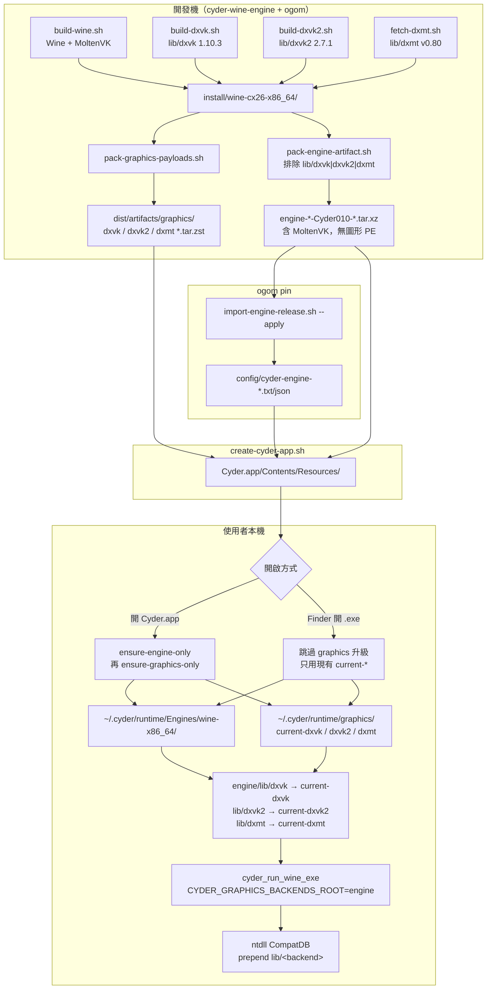
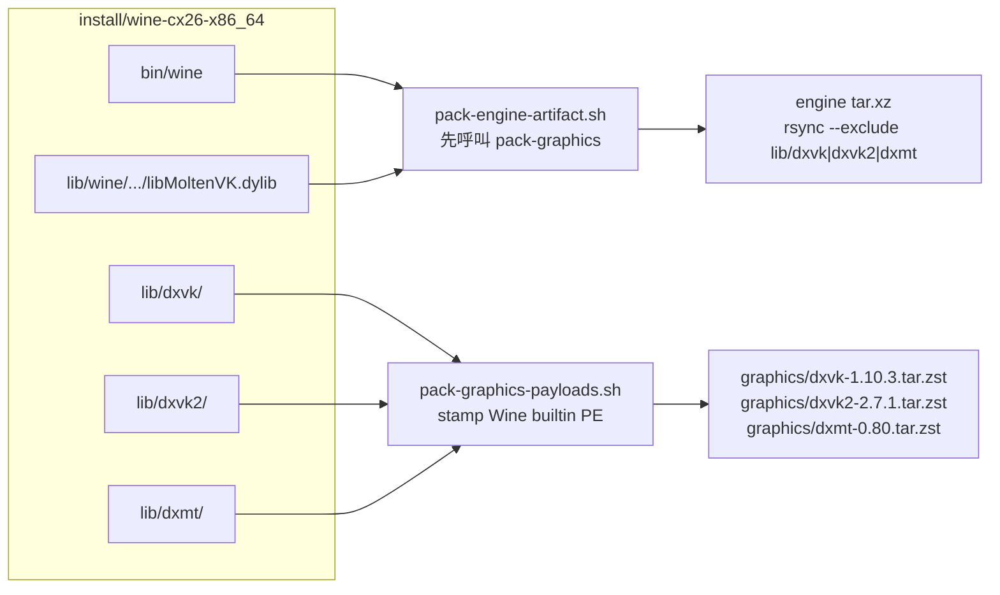
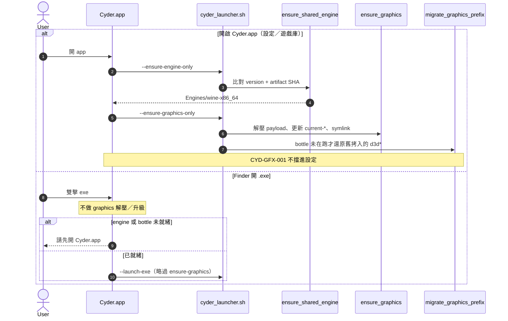
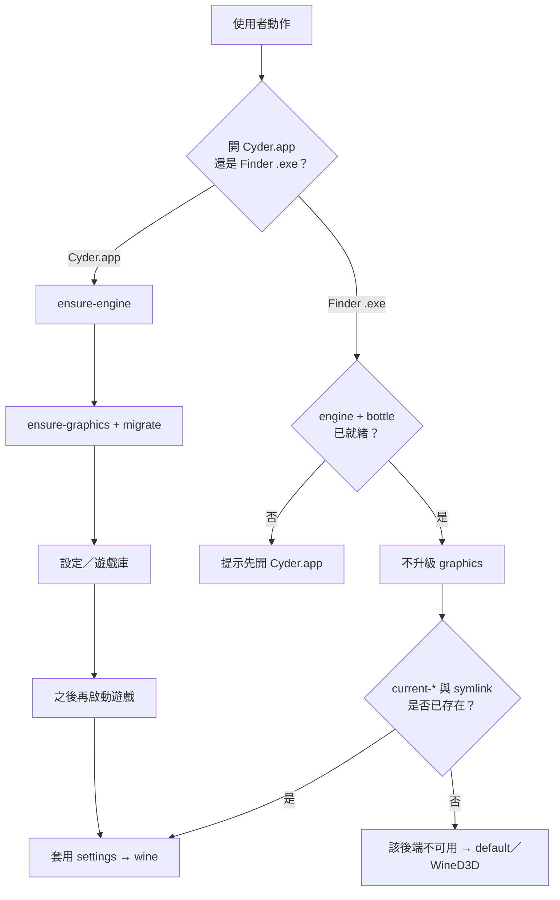

# 引擎、圖形轉譯層與 Runtime 載入

> 對象：開發／發布。說明 **Wine engine**、**DXVK／DXVK 2／DXMT payload**、
> **MoltenVK** 與 **CompatDB prepend** 如何分開安裝、再在啟動時接起來。  
> 使用者選項見 [圖形後端](cyder-graphics-backends.zh-TW.md)；編譯細節見
> [DXVK 編譯備忘](build-dxvk.zh-TW.md)；engine 專案邊界見
> [Wine engine 專案](cyder-wine-engine-project.md)。

三件事不要混在一起：

| 層 | 是什麼 | 打進哪 | 本機落點 |
|----|--------|--------|----------|
| **Engine** | Wine + MoltenVK + media；**不含** DXVK／DXMT PE | `Resources/engine-*.tar.xz` | `~/.cyder/runtime/Engines/wine-x86_64/` |
| **Graphics payload** | DXVK 1.10.3、DXVK 2.7.1、DXMT v0.80 的 PE（+ DXMT `winemetal.so`） | `Resources/graphics/*.tar.zst` | `~/.cyder/runtime/graphics/` |
| **Runtime 載入** | 啟動時 CompatDB **builtin + prepend**，bottle 內 `d3d*` 維持 Wine 內建 | 無額外檔案 | 程序環境變數 + engine `lib/{dxvk,dxvk2,dxmt}` symlink |

GPTK／D3DMetal 不隨 app 出貨，不在這三層裡。

---

## 1. 總覽



重點：**圖形 PE 先從 install 樹打成獨立 archive，再從 engine tar 剔除。**
Runtime 用 symlink 把兩份貨接成 CompatDB 認得的 `ENGINE/lib/<token>` 布局。
MoltenVK 必須留在 engine，因為 DXVK 家族的可用性檢查讀的是
`lib/wine/x86_64-unix/libMoltenVK.dylib`（或 `lib64/libMoltenVK.dylib`）。

---

## 2. 開發機：編譯與打包

Install 樹同時有 Wine 與圖形 PE，只為了本機測試與打包來源。出貨拆成兩個 artifact。



| 腳本 | 做什麼 |
|------|--------|
| `scripts/build-wine.sh` | 在 **cyder-wine-engine** 建 Wine；CompatDB 必須已接受 `dxvk2` 才會讓 UI 選項生效 |
| `scripts/build-dxvk.sh` | 1.10.3 → `lib/dxvk`；寫 `version`；stamp `"Wine builtin DLL"` |
| `scripts/build-dxvk2.sh` | 2.7.1 → `lib/dxvk2`；不碰 `lib/dxvk` |
| `scripts/fetch-dxmt.sh` | 上游 v0.80 → `lib/dxmt` |
| `scripts/pack-graphics-payloads.sh` | 從上述三棵樹打 zstd + `*-version.txt` + `*-artifact-sha256.txt` |
| `scripts/pack-engine-artifact.sh` | **先** pack graphics，再 stage engine 並排除三棵圖形樹 |
| `scripts/import-engine-release.sh --apply` | 驗證 manifest／NTDLL SHA，寫入 `config/cyder-engine-*` |
| `scripts/create-cyder-app.sh` | 複製 pin 住的 engine tar **與** 三組 graphics sidecar；缺一則失敗（`CYDER_ALLOW_MISSING_GRAPHICS=1` 除外） |

Engine 升級（例如 `Cyder010-dxvk2`）只換 ntdll／Wine；圖形 payload 版本由
`lib/*/version` 與 sidecar 獨立演進。

---

## 3. App 內貨源與本機 runtime 布局

```text
Cyder.app/Contents/Resources/
  engine-<label>.tar.xz              # 或 engine-archive.txt 指向的檔名
  engine-version.txt
  graphics/
    dxvk-1.10.3.tar.zst
    dxvk-version.txt                 # 1.10.3
    dxvk-artifact-sha256.txt
    dxvk2-2.7.1.tar.zst
    dxvk2-version.txt
    dxvk2-artifact-sha256.txt
    dxmt-0.80.tar.zst
    dxmt-version.txt
    dxmt-artifact-sha256.txt

~/.cyder/runtime/
  Engines/wine-x86_64/               # 解壓後的 Wine + MoltenVK
    bin/wine
    lib/wine/x86_64-unix/libMoltenVK.dylib
    lib/dxvk  → 相對路徑 ../../../graphics/current-dxvk
    lib/dxvk2 → ../../../graphics/current-dxvk2
    lib/dxmt  → ../../../graphics/current-dxmt
  graphics/
    dxvk/1.10.3/                     # 解壓內容（含 x86_64-windows/d3d11.dll）
    dxvk2/2.7.1/
    dxmt/0.80/
    current-dxvk  → dxvk/1.10.3
    current-dxvk2 → dxvk2/2.7.1
    current-dxmt  → dxmt/0.80
```

`cyder-ensure-graphics.sh`：比對 sidecar version 與
`graphics/<name>/<ver>/.cyder-graphics-version`；不同才解壓。然後原子更新
`current-*`，並把 engine `lib/<name>` 換成**相對** symlink。
在受管 `CYDER_ENGINES` 外若已是實體目錄，會拒絕 `rm -rf`。

---

## 4. 安裝時序（誰先誰後）



| 步驟 | 腳本／入口 | 條件 |
|------|------------|------|
| 1. 裝／升級 engine | `cyder_ensure_shared_engine` | version 不同，或同版但 SHA 不同 |
| 2. 裝／升級 graphics | `cyder_ensure_graphics` | sidecar version ≠ 已解壓 marker |
| 3. 接線 | `lib/dxvk{,2}`、`lib/dxmt` → `current-*` | 每次 ensure-graphics |
| 4. 遷移舊 bottle | `cyder_migrate_graphics_prefix` | 偵測舊 Cyder 拷入的 DXVK／DXMT PE；prefix 使用中則延後 |
| 5. Bootstrap bottle | `cyder_bootstrap_shared_prefix` | 開 Cyder 且 marker 未齊；**不再**把 DXVK 拷進 system32 |

`cyder_prepare_graphics_prefix` 在有 graphics 貨源時會先跑 ensure，再開 Cyder
的 `--ensure-graphics-only` 會再跑一次（第二次應是 no-op）。Finder 的
`--launch-exe` **不**走這條。

Engine 大版本升級會 `cyder_reset_shared_prefix`；圖形 payload 換版**不會**重做 bottle。

---

## 5. 啟動時如何載入轉譯層

Bottle 的 `system32`／`syswow64` 維持 Wine 內建 `d3d*`／`dxgi`。真正換成 DXVK／DXMT
是 **process-local**：環境變數 + ntdll CompatDB prepend。

```mermaid
sequenceDiagram
  autonumber
  participant S as settings.json
  participant Sh as cyder_apply_graphics_preference
  participant W as wine / ntdll
  participant C as apply_graphics_backend
  participant FS as ENGINE/lib/&lt;token&gt;

  S->>Sh: graphicsBackend=dxvk2
  Sh->>Sh: 有 lib/dxvk2/.../d3d11.dll？
  alt payload 在
    Sh->>W: CYDER_GRAPHICS_BACKEND=dxvk2
    Sh->>W: DXVK_FRAME_RATE / DXVK_HUD（dxvk 與 dxvk2）或 DXMT_CONFIG 限幀
  else 缺失
    Sh->>W: 不設 backend（等同 default）
  end
  W->>W: CYDER_GRAPHICS_BACKENDS_ROOT=engine 根
  W->>C: 讀 CYDER_GRAPHICS_BACKEND
  C->>C: valid_graphics_backend("dxvk2")
  C->>FS: root/lib/dxvk2 + MoltenVK
  alt 模組存在且已 stamp builtin
    C->>C: load-order "b" + prepend_dll_path
    C-->>W: 載入 DXVK 2 PE（位址 ≠ Wine 內建）
  else 不可用
    C-->>W: 回退 wined3d
  end
```

| 變數 | 角色 |
|------|------|
| `CYDER_GRAPHICS_BACKEND` | `dxvk`／`dxvk2`／`dxmt`／`wined3d`／`d3dmetal`；`default` 不強制，交給 CompatDB 規則 |
| `CYDER_GRAPHICS_BACKENDS_ROOT` | 設成 **engine 根**（`bin/wine` 的上一層），讓 `lib/%s` 與 MoltenVK 同一棵樹 |
| `CYDER_GRAPHICS_BACKEND_PATH` | 可選；直接指定 backend 目錄。`cxcompatdb.so` 會 canonicalize，檢查目前 PE machine、builtin signature、必要 DLL 與 host dependency，失敗回退 WineD3D |
| `CX_GRAPHICS_BACKEND` | 與上者同步，對齊 CrossOver 命名 |
| `DXVK_FRAME_RATE`／`DXVK_HUD` | 僅手動 DXVK 或 DXVK 2（60／120／144） |
| `DXMT_CONFIG` | 僅手動 DXMT；合併 `d3d11.preferredMaxFrameRate` |

Cyder `cxcompatdb.so`（由 CrossOver 原始 ntdll 的既有 hook 載入）：

- `valid_graphics_backend` 接受 `dxvk`（4）與 `dxvk2`（5）。
- 未指定直接路徑時，從 engine root 的 `lib/<backend>` 推導。
- `dxvk` 與 `dxvk2` 都檢查 MoltenVK。
- Load-order 為 `"b"`（builtin）。Wine 只把 PE offset 64 寫著 `"Wine builtin DLL"` 的模組當 builtin；stamp 發生在 build／pack，不是啟動時。
- 成功與失敗 log 都包含實際使用或拒絕的 backend 路徑。

舊 engine（Cyder010 及更早）沒有 Cyder `cxcompatdb.so`，仍由當時的 ntdll patch 處理。
現行 pin：`CX26.3.0-W11-Cyder010-dxvk2`。

---

## 6. 兩條啟動路徑對照



Swift：`prepareEnvironmentAndShowSettings` 走完整 ensure；
`runPhasedLaunch`（Finder）只檢查 `environmentState`，**不**呼叫
`--ensure-graphics-only`。缺 payload 時軟提示，仍嘗試啟動。

---

## 7. 責任邊界

| 專案 | 擁有 |
|------|------|
| **cyder-wine-engine** | Wine／MoltenVK 建置、CompatDB patch 進 ntdll、engine pack（排除圖形樹）、minOS |
| **ogom（Cyder）** | DXVK／DXMT 編譯與 pack、ensure-graphics、設定 UI、CompatDB YAML、app 打包 |

本機 `install/wine-cx26_x86_64` 常是 ogom → engine 的 symlink；**pack／rebuild 仍應在 engine repo** 跑，以免 `.env` 與 minOS 旗標錯位。

---

## 8. 常見斷點

| 症狀 | 先查 |
|------|------|
| 選 DXVK 2 沒有效果，像 default | Engine 是否 Cyder010+（`strings ntdll.so \| grep dxvk2`）；`CYDER_GRAPHICS_BACKEND` 是否真的是 `dxvk2` |
| 選項灰掉 | 是否開過 Cyder.app 做 ensure；`lib/dxvk2/x86_64-windows/d3d11.dll` 與 MoltenVK 是否可讀 |
| prepend 仍落到 WineD3D | PE 有無 `"Wine builtin DLL"` stamp；`WINEDEBUG=+loaddll` 位址是否異於 wined3d |
| Finder 一直用舊 DXVK | 預期：Finder 不升級；開一次 Cyder.app |
| `create-cyder-app` 失敗 | `dist/artifacts/graphics/` 是否三組 version／sha／tar 齊 |

驗證契約（不需開遊戲）：

```bash
bash tests/test-cyder-pack-graphics-payloads.sh
bash tests/test-cyder-ensure-graphics.sh
bash tests/test-cyder-graphics-prepend.sh
```

## 相關文件

- [圖形後端（使用者選項）](cyder-graphics-backends.zh-TW.md)
- [DXVK 編譯備忘](build-dxvk.zh-TW.md)
- [Wine engine 專案邊界](cyder-wine-engine-project.md)
- [CompatDB 維護](cyder-compatdb.zh-TW.md)
- [腳本參考](scripts.md)
