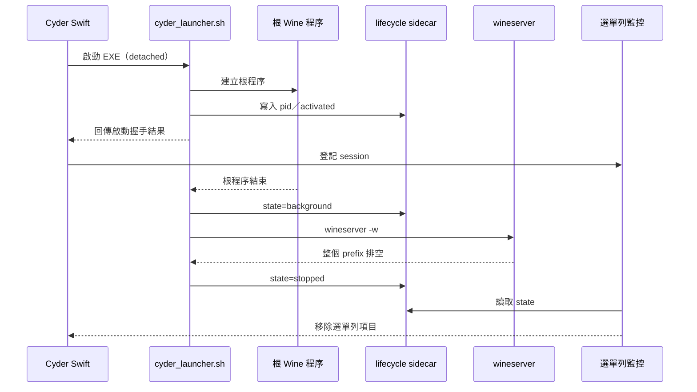
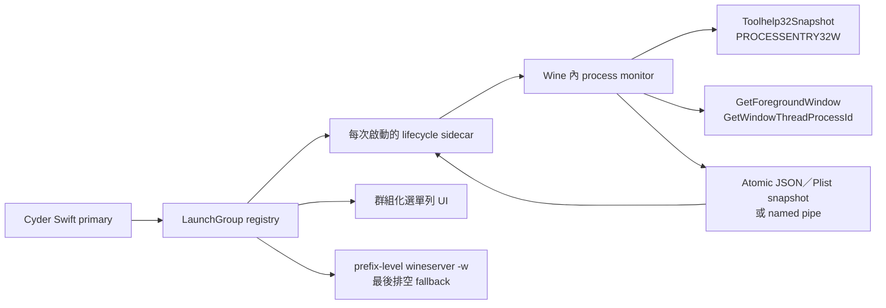
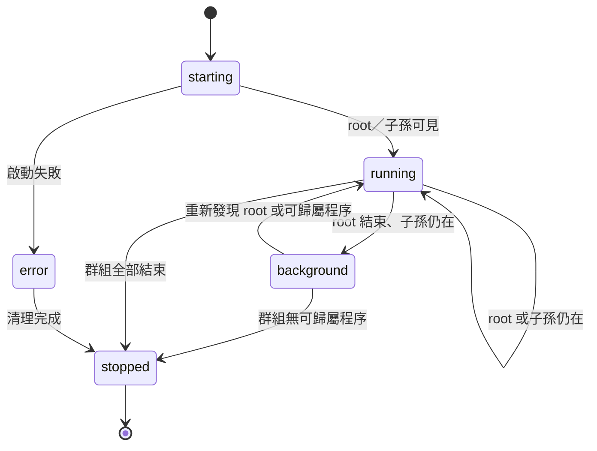

# Cyder Session 與 Windows 程序監控設計

> 狀態：設計記錄，尚未實作
>
> 更新日期：2026-08-12

## 目的

目前 Cyder 的選單列 session 是以「這次啟動的根程序」和「prefix 是否仍被
`wineserver` 使用」判斷。這對單一、前景、離開時會保持存活的遊戲足夠，但不適合
Steam 這類啟動器：`steam.exe` 可能在 `steamwebhelper.exe`、`steamservice.exe`
等背景程序啟動後自行結束。

本文件先記錄問題與建議方案，作為後續修改程式的契約。本文不代表目前已完成
process monitor，也不改變現有行為。

## 目前的生命週期模型

一次 Cyder 啟動目前同時有三個不同層次，容易被誤當成同一件事：

| 層次 | 意義 | 目前用途 |
|------|------|----------|
| 啟動請求 | 使用者要求開啟某個 EXE，以及這次的 argv／設定 | Swift launcher 建立 lifecycle sidecar |
| 根程序 | 例如 `steam.exe`、`MapleStory.exe` | 啟動器等待它建立並記錄其結束 |
| Prefix session | 同一 `WINEPREFIX` 中仍在執行的所有 Wine 程序 | 以 `wineserver -w` 判斷 prefix 是否排空 |

目前 detached 啟動的流程大致如下：



關鍵點是：shell launcher 回傳只代表「已完成啟動握手」，不是 Wine session
已結束；根程序結束也只代表該 EXE 結束。`wineserver -w` 則是 prefix-wide
判斷，會等待同一 prefix 的其他程式。

因此現在會出現以下現象：

1. `steam.exe` 結束、Steam helper 還在時，Cyder 只能顯示「主程序已結束，等待背景
   程序」，但不知道究竟是哪一個 helper 還活著。
2. Steam 和楓之谷共用 prefix 時，楓之谷可能讓 Steam 的 `wineserver -w` 一直等著，
   兩個 session 看起來像綁在一起。
3. 如果單純把選單改成「目前活著的程序清單」，`steam.exe` 一離開，Steam 這個
   使用者啟動的工作就會消失，剩下的 `steamwebhelper.exe` 也沒有穩定的 Steam 標籤。
4. 只看 macOS `ps` 的程序樹不可靠：Unix PID 與 Windows PID 不同，Wine 程序可能
   被 reparent 或由 Wine server 代為管理，也沒有可靠的 Windows 前景視窗資訊。

## 目標行為

選單列應顯示「使用者啟動的工作群組」，而不是只顯示根 EXE，也不是把 prefix
內的所有程序平鋪成清單。預期畫面概念如下：

```text
Steam
  ● steamwebhelper.exe
  ● steamservice.exe
  ○ steam.exe（主程序已結束）

楓之谷
  ● MapleStory.exe（前景）
  ● grap-core64.aes
```

同一 prefix 不應因此合併成一個工作：Steam 的 helper 存活，不應阻止楓之谷顯示
自己的狀態；楓之谷存活，也不應讓已經沒有 Steam 相關程序的 Steam 列表項目一直
等待。

如果發現同一 prefix 有無法歸屬到任何 Cyder 啟動群組的程序，應顯示為獨立的
「其他 Windows 程序（同一 prefix）」或只留在診斷資訊中，而不是誤歸給最後一次
啟動的遊戲。

## 建議的資料模型：LaunchGroup

每次由 Cyder 發出的啟動建立一個 `LaunchGroup`，並保留現有 lifecycle session
作為群組的生命週期外框：

| 欄位 | 說明 |
|------|------|
| `launchID` | 每次啟動唯一值；不能只用 prefix 或 executable path |
| `prefix` | 群組所屬的 `WINEPREFIX` |
| `rootExecutable` | 使用者直接要求開啟的 EXE，例如 `steam.exe` |
| `rootWindowsPID` | 根程序的 Windows PID；若尚未取得可為空 |
| `observedPIDs` | 曾經屬於此群組的 Windows PID、映像名稱與最後觀察時間 |
| `descendantPIDs` | 由 parent PID 樹推導出的目前子孫程序 |
| `foregroundPID` | 最近一次對應到前景視窗的 PID，僅作顯示用途 |
| `lifecycleState` | `starting`、`running`、`background`、`stopped`、`error` |
| `lastUpdate` | 監控資料最後更新時間 |

`observedPIDs` 必須保留短暫歷史，因為 Steam helper 可能 reparent 或透過另一個
啟動路徑建立。若程序無法再由 parent tree 證明歸屬，不應立即刪除群組；可以先
標記為 `background`，並在逾時後轉為未歸屬程序或停止。

## 程序與前景偵測方案比較

| 方案 | 優點 | 缺點 | 建議 |
|------|------|------|------|
| 保留 `wineserver -w` | 最簡單、穩定、不需新增 helper | 只知道 prefix 是否排空，無法分辨 Steam 與楓之谷 | 作為最後的 prefix drain，不作為 app 群組完成條件 |
| macOS `ps`／Unix process tree | 不需 Wine 內 helper | PID 對不上、reparent、無 Windows 前景視窗 | 不作為主要來源，可放在診斷 fallback |
| 週期呼叫 `wine tasklist` | 可快速驗證 Windows 程序清單；現有 Wine 已有 `tasklist.exe` | 每次查詢都建立 Wine client，會增加 polling 與 wineserver 活動；輸出不含可靠前景資訊 | 可作早期 POC，不作最終監控 |
| Wine 內隱藏 Win32 monitor | 可用 Windows PID／parent PID；可用 `GetForegroundWindow`；不需先 patch ntdll | 要管理 helper 自己的生命週期、IPC 與 Steam reparent 邊界 | **第一個正式版本建議採用** |
| wineserver process-event patch | 可由 server 主動提供建立／結束事件，效率與完整性最好 | 需要 engine patch、版本同步、IPC 契約與更多回歸測試 | 監控 helper 不足時再評估 |

## 建議架構

第一階段不修改原始 CrossOver ntdll，也不把 `wineserver -w` 的 prefix-wide
語意硬改成 per-app。由 Cyder 啟動一個隱藏的 Wine 內 monitor，將程序快照與
前景 PID 寫入每次啟動專屬的 sidecar；Swift 只消費 sidecar 並更新選單列。



### Wine 內 monitor 的資料來源

- `CreateToolhelp32Snapshot(TH32CS_SNAPPROCESS)` 與 `PROCESSENTRY32W`：取得
  Windows PID、parent PID、映像名稱。
- 從根 PID 沿 parent PID 建立子孫樹，並合併已觀察的 PID 歷史。
- `GetForegroundWindow()` 加 `GetWindowThreadProcessId()`：標出目前前景程序。
  前景只影響 UI 標示，不作為程序是否存活的判斷。
- Wine server 內部其實已有 process list 所需的 `process_id`、`parent_pid`、
  Unix PID、映像名稱與 start time；第一階段不直接改用該內部 protocol，避免
  把 Cyder 的 UI 契約綁到 engine patch。

### 監控週期與歸屬

1. 啟動成功後，以 root Windows PID 建立群組；若 PID 尚未可得，先以 executable
   與啟動時間暫存，待下一次快照補上。
2. 每個 polling 週期取得 process snapshot，排除 monitor 本身與 Wine 內部基礎
   程序（例如 wineserver、preloader，以及不應顯示的服務程序）。
3. 以 parent PID 樹歸屬直接與間接子孫；保留 PID、映像名稱、start time，避免 PID
   重用造成誤認。
4. 先更新 `foregroundPID`，再以 root／descendant 存活情況更新群組狀態。
5. 將完整快照以原子替換寫入 sidecar，避免 Swift 讀到半個 JSON／Plist。
6. 所有 LaunchGroup 都沒有可歸屬程序後，monitor 必須先結束；接著 supervisor
   才能執行現有 `wineserver -w` 作 prefix 最終排空。

monitor 不能為了持續回報而永久存活，否則 monitor 自己就是 Wine client，反而會
讓 `wineserver -w` 永遠等不到結束。這是實作時最重要的生命週期限制。

## 群組狀態機



| 狀態 | UI 文案方向 | 完成條件 |
|------|-------------|----------|
| `starting` | 正在啟動 | 尚未取得穩定 root／子孫快照 |
| `running` | 執行中 | root 或已歸屬子孫仍在 |
| `background` | 主程序已結束，背景程序仍執行 | root 已離開但群組仍有程序 |
| `stopped` | 不再列出 | 群組沒有可歸屬程序；之後由 supervisor 做 prefix drain |
| `error` | 啟動失敗 | 啟動握手或 monitor 發生不可恢復錯誤 |

`wineserver -w` 完成只能表示整個 prefix 沒有 Wine client，不代表某個
LaunchGroup 的根程序或子孫仍然存在。因此它只負責最後的 prefix 清理與 fallback
狀態，不應再直接決定每個選單列項目何時消失。

## UI 顯示原則

- 頂層顯示 `rootExecutable` 的使用者可讀名稱，保留 Steam 即使 `steam.exe` 已離開。
- 子項顯示目前可歸屬的程序名稱；前景程序加上「前景」標示。
- 根程序結束但 helper 還在時，保留根名稱並顯示背景狀態，不把 helper 冒充成新的
  額外 session。
- 同一 prefix 的不同 LaunchGroup 分開顯示。
- 無法歸屬的 prefix 程序顯示為診斷／其他程序，不要猜測它屬於哪個遊戲。
- 使用者看到的是工作群組；PID、Unix PID、start time 與 parent chain 只寫入診斷
  log 或展開的除錯資訊。

## 典型情境

### Steam 啟動器

1. Cyder 啟動 `steam.exe`，建立 `Steam` 群組。
2. `steam.exe` 建立 `steamwebhelper.exe`、`steamservice.exe` 後結束。
3. monitor 仍能從已觀察 PID／parent history 辨識 helper；群組轉為
   `background`，Steam 項目不會消失。
4. 所有 Steam 可歸屬程序結束後，Steam 項目消失；不會因為同 prefix 的楓之谷仍在
   執行而繼續等待。

### Steam 與楓之谷同時執行

1. 先建立 `Steam` 群組，再建立 `楓之谷` 群組；兩者有不同 `launchID`。
2. monitor 分別維護兩棵程序樹，並以前景 PID 標出目前使用者正在操作的程序。
3. 關閉 Steam 只結束 Steam 群組；楓之谷群組仍顯示執行中。
4. 所有群組結束後才進入 prefix-level `wineserver -w` 的最後排空。

### 不可歸屬的背景服務

若 Steam 或其他程式透過特殊 IPC 重新建立程序，已無法從 parent tree 判斷歸屬，
monitor 應保留「其他 Windows 程序（同一 prefix）」而不是把它算到最近啟動的遊戲。
這會犧牲部分自動歸屬，但比錯誤延長某個 session 的生命週期更容易理解與除錯。

## 實作分期

### Phase 1：契約與觀測（本文件）

- 固定 `LaunchGroup` 欄位、狀態機、sidecar 格式與程序過濾規則。
- 確認目前 lifecycle sidecar 與 menu bar session 的相容欄位。
- 先不修改 engine、ntdll 或 `wineserver -w`。

### Phase 2：App-side monitor

- 新增 Wine 內隱藏 monitor 與每次啟動的 sidecar／IPC。
- Swift primary 以 LaunchGroup 聚合選單列，保留現有單一 Cyder icon 與 primary
  instance 機制。
- 加入 Steam helper、同 prefix 多程式、root 先結束等驗收測試。

### Phase 3：必要時再考慮 engine event

若 parent tree 在實際遊戲中仍不足，再評估將 Wine server 的 process create/exit
事件以穩定 API 暴露給 monitor。這會需要 engine patch、版本 pin、跨架構測試與新的
IPC 契約，不應為了修正目前 UI 誤判而提前擴大 patch 範圍。

## 驗收條件

- `steam.exe` 結束而 `steamwebhelper.exe` 存活時，Steam 項目仍存在並標為背景執行。
- Steam 與楓之谷共用 prefix 時，兩個 LaunchGroup 可以分別結束，不互相延長 UI
  session。
- 根程序和所有可歸屬子孫結束後，群組能在合理 polling 延遲內消失。
- 未歸屬的 prefix 程序不會被誤算到任一遊戲。
- monitor 結束後 `wineserver -w` 能正常完成；不可因 monitor 自己存活而卡住。
- 前景標示改變不會觸發 session 結束或重新建立。
- 啟動失敗、monitor crash、PID 重用與 sidecar 部分寫入都有可讀診斷資訊。
